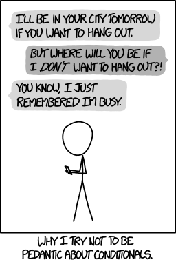

# Control Flow

::: callout
## Learning Objectives
+ 
+ 
+
:::

Control flow refers to statements in a computer program that that determines
when, how, and how many times code is evaluated. In this reading you will learn
about the two main types of control flow structures---`if` statements and 
`for()` loops. 

## Conditionals in Everyday Life

We are going to teach you about conditionals in R, but before we do it is good
to remember that we use these types of statements *all* the time. Anytime you 
use if-then logic you are using a conditional!

{fig-alt=""}
These ideas go back to the practice activity we did with paper airplanes. 
With conditionals, we need to state *exactly* what we mean because the computer
will do whatever we tell it to do. 

## Conditional Statements

A conditional statement determines what code is evaluated. In general, 
conditional statements look something like this:

```
if (condition){
  stuff to do
}
  else{
  other stuff to do
}
```

When the computer encounters a conditional statement, it first checks to see 
if the condition is met (`TRUE`) or if is is not met (`FALSE`). If the condition
is `TRUE`, then the computer will execute the "stuff to do" inside the first set
of `{}`. If the condition is `FALSE`, then the computer will execute the "other
stuff to do" inside the second set of `{}`

### Conditional Statements in R

In R, conditional statements look something like this:

```{r}
#| eval: false
#| label: example-if-else-format

x <- 3

if (x > 2) { 
  y <- 8
} else {
  y <- 4
}

```

There are a few things we need to notice about the syntax. First, we are using
two words `if` and `else` to build the control flow. These are reserved names 
that R recognizes exactly for this type of task. Second, the condition being 
checked comes after `if` and is contained in parentheses. The "stuff to do" 
when the condition is `TRUE` is enclosed in `{}`. This makes it easier to see
what code is attached to each case. 

If the condition is `FALSE`, then R will execute the "other stuff to do"
contained in the `{}` after `else`. 

**What value should `y` have?**

<!-- this would be a good spot for an interactive code blurb -->

### Conditional Statements as Diagrams

### Chaining Conditional Statements
 

[20 minutes] Activity: Give half the students one prompt and half another -- sketch diagram and trade for coding/implementation

<!-- ### Help tab -->

<!-- The help tab is a wonderful way to get help with how to use an R or python function. -->

<!-- {fig-alt="Screenshot of RStudio help tab. Search bar is highlighted and annotated with 'search for function name here', and then the main window is annotated with 'Documentation appears here'."} -->

<!-- By default, you can search for an R function name in the search window, and documentation for matching functions will appear in the main part of the pane.  -->

## Loops

<!-- [15 minute lecture] Loops -->
<!-- While + break -->
<!-- for -->

<!-- [20 minutes] Activity: Give half the students one prompt and half another -- sketch diagram and trade for coding/implementation -->
<!-- Something like FizzBuzz -->
