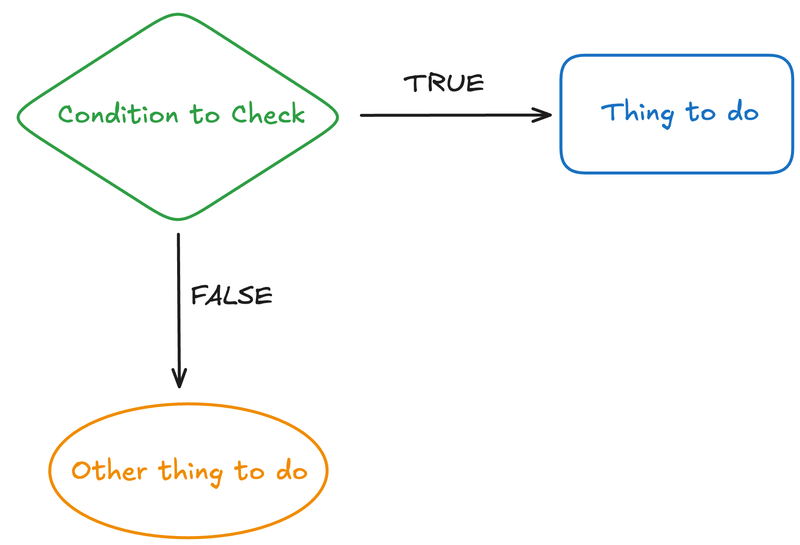
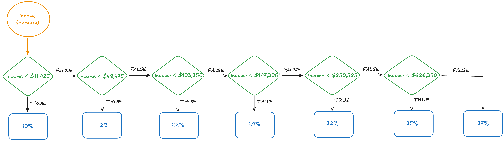
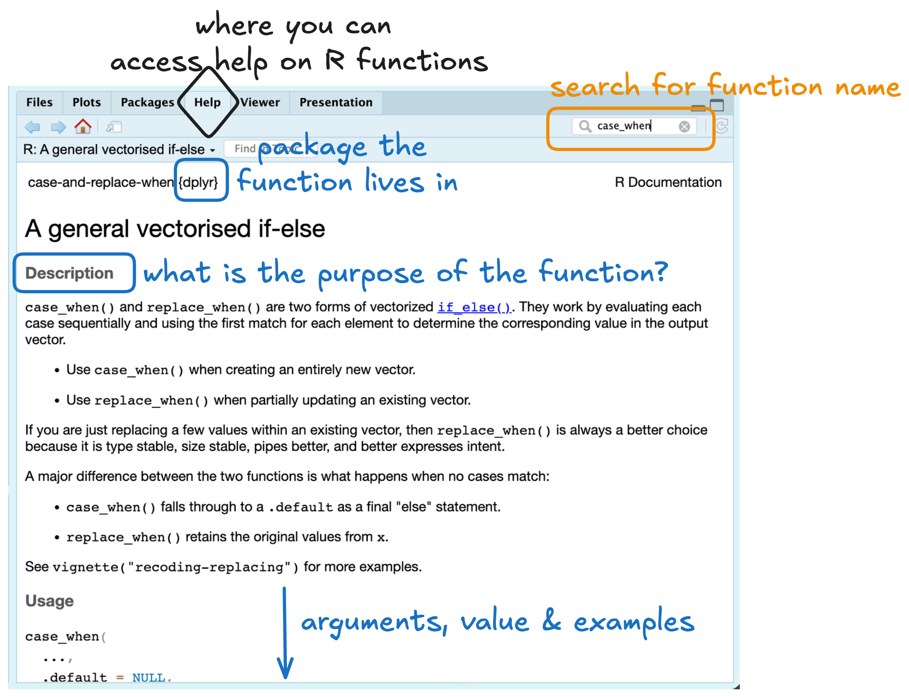
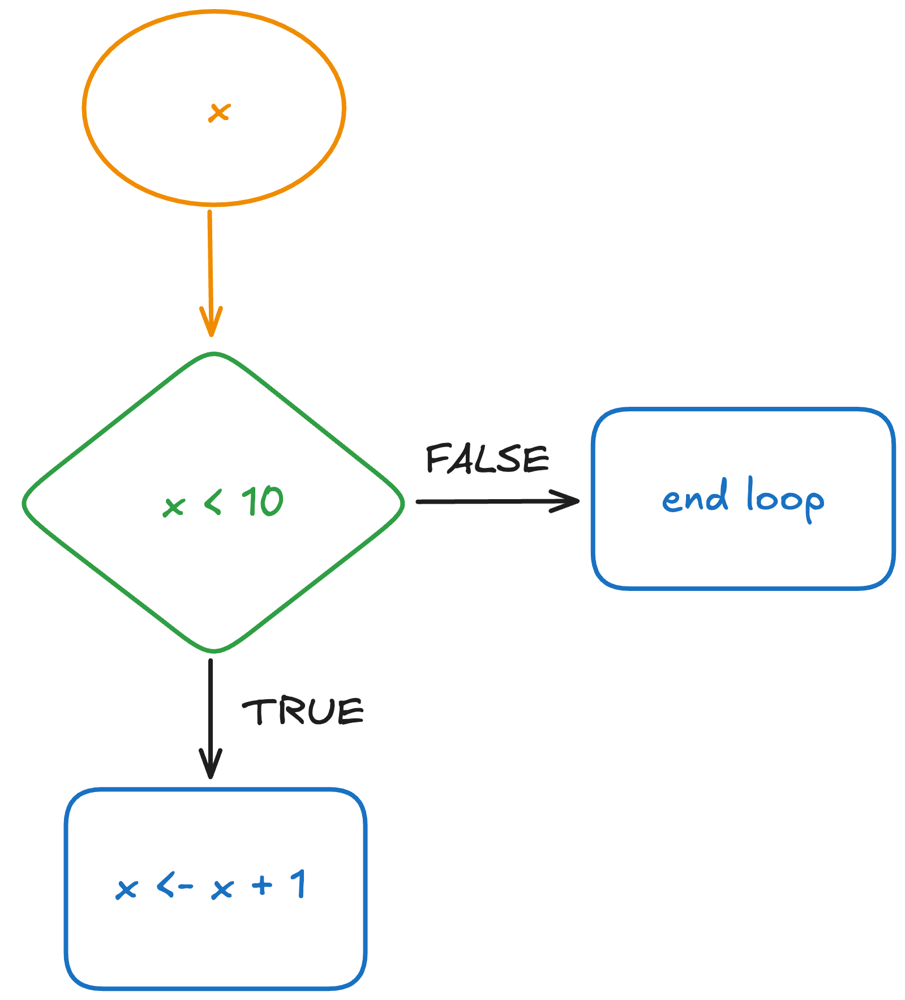

---
filters:
 - flourish
---


<!-- ```{r} -->
<!-- #| flourish: -->
<!-- #| - target:  -->
<!-- #|     - "is.numeric" -->
<!-- #|     - mask: true -->
<!-- #|     - style: "text-decoration: underline;" -->
<!-- ``` -->

# Control Flow

::: callout
## Learning Objectives

- What a conditional statement is
- How to create a simple conditional statement with `if ()` and `else`
- How to series of conditional statements with `else if ()`
- What it means for a function to be vectorized
- How to make a vectorized conditional statement
- Where to access help on an R function
- Recognize when to use a `for ()` loop instead of a `while ()` loop
- Understand how to index a loop
:::

```{r}
#| label: package-for-case-when
#| echo: false

library(dplyr)
```

Control flow refers to statements in a computer program that that determines 
when, how, and how many times code is evaluated. In this reading you will learn
about the two main types of control flow structures---`if` statements and
`for()` loops.

## Conditionals in Everyday Life

We are going to teach you about conditionals in R, but before we do it is good
to remember that we use these types of statements *all* the time. Anytime you
use if-then logic you are using a conditional!

{fig-alt="A comic of a stick person and a series of speech bubbles. The person says 'I'll be in your city tomorrow if you want to hangout.' The person they are talking to (presumably in the background) responds 'But where will you be if I don't want to hang out?' The person then says 'You know, I just remembered I'm busy.' The bottom of the comic says 'Why I try not to be pedantic about conditionals."}

These ideas go back to the practice activity we did with paper airplanes. With
conditionals, we need to state *exactly* what we mean because the computer will
do whatever we tell it to do.

## Conditional Statements

A conditional statement determines what code is evaluated. In general,
conditional statements look something like this:

```         
if (condition){
  stuff to do
}
  else{
  other stuff to do
}
```

When the computer encounters a conditional statement, it first checks to see if
the condition is met (`TRUE`) or if is is not met (`FALSE`). If the condition is
`TRUE`, then the computer will execute the "stuff to do" inside the first set of
`{}`. If the condition is `FALSE`, then the computer will execute the "other
stuff to do" inside the second set of `{}`

### Conditional Statements in R

In R, conditional statements look something like this:

```{r}
#| eval: false
#| label: example-if-else-format

x <- 3

if (x > 2) { 
  y <- 8
  } else {
  y <- 4
  }

```

There are a few things we need to notice about the syntax. First, we are using
two words `if` and `else` to build the control flow. These are reserved names
that R recognizes exactly for this type of task. Second, the condition being
checked comes after `if` and is contained in parentheses (`x > 2`). The "stuff
to do" when the condition is `TRUE` is enclosed in `{}` **immediately after**
the `if()` statement. If the condition is `FALSE`, then R will execute the 
"other stuff to do" contained in the `{}` after `else`.

**What value should `y` have?**

<!-- this would be a good spot for an interactive code blurb -->

::: callout-important
# Code Style

We could have written the above code as:

```{r}
#| eval: false
#| label: bad-if-else-format

if (x > 2) y <- 8  else y <- 4
```

and we would have gotten the same result. So, why should we make our code so
**long**?

A braced expression, `{}`, defines the most important hierarchy of R code. So, 
we want to make the hierarchy easy to understand. To do this, our code should
follow these three principles:

1.  A `{` should be the last character on the line (e.g., `if (x > 2) {` ).

2.  The contents *inside* the `{` should be indented by two spaces.

3.  A `}` should be the first character on the line (e.g., `} else {`)

4.  A space should be included between `if` and the `(` starting the condition

Each of these principles of code style come from the 
[Syntax section of the tidyverse style guide](https://style.tidyverse.org/syntax.html). 
We will use this style guide throughout the course!
:::

::: {.callout-check-in}
1. Which of the following is the correct way to format a conditional statement?

(a)
```{r}
#| label: question-1-a
#| eval: false

if (num < 100){
  print(num)
}
else {
  print("banana")
}
```

(b)
```{r}
#| label: question-1-b
#| eval: false

if (num < 100){
  print(num)
} else {
  print("banana")
}
```

(c)
```{r}
#| label: question-1-c
#| eval: false

if (num < 100){ print(num) } else { print("banana") }
```

(d)
```{r}
#| label: question-1-d
#| eval: false

if (num < 100) print(num) else print("banana") 
```

:::

### Conditional Statements as Diagrams

We find it quite useful to represent conditional statements as diagrams. By
drawing out the diagram (even if it is simple), you can more clearly anticipate
what the result of the process will be.

{fig-alt="A simple diagram of what comprises an if/else conditional. At the top there is a green diamond and the inside of the diamond reads 'Condition to Check'. There are two arrows exiting the diamond, one pointing to the right that reads 'TRUE' and one pointing down that reads 'FALSE'. These represent the outcome of the conditional check. At the end of the 'TRUE' arrow there is a rectangle that reads 'Thing to do' representing what is done if the condition is met (TRUE). As the end of the 'FALSE' arrow there is a circle that reads 'Other thing to do' representing what is done if the condition is not met (FALSE)." width="60%"}

::: {.callout-check-in}
2. With `if` + `else` you have ____ condition(s) to check and ____ possible 
outcome(s).
:::

## Chaining Conditional Statements

In our previous conditional statement we only used `if` and `else`, but that
only works if you have **two** possible outcomes or **one** condition you need
to check. In many cases we have more than one condition to check, so we will
need to modify our conditional statement.

When we have more than one condition to check, we can use an `else if ()`
statement. `else if ()` works similar to an `if ()` statement, where you specify
a condition to check in the parentheses. This looks something like:

```         
if (condition 1) {
  stuff to do 
} else if (condition 2) {
  other stuff to do
} else {
  other other stuff to do
}
```

### Multiple Conditions for Tax Brackets

Suppose we wanted to create conditional statements to know how much in federal
taxes someone in the US might pay. Based on the [current IRS tax rates](https://www.irs.gov/filing/federal-income-tax-rates-and-brackets) we have
the following outcomes[^03-control-flow-1]:

| Income Range         | Taxes |
|----------------------|-------|
| \$0 to \$11,925      | 10%   |
| \$11,926 to \$48,475 | 12%   |
| \$48,476 \$103,350   | 22%   |
| \$103,351 \$197,300  | 24%   |
| \$197,301 \$250,525  | 32%   |
| \$250,526 \$626,350  | 35%   |
| \$626,351 and above  | 37%   |

[^03-control-flow-1]: Technically, this is a bit of an over simplification. 
If you make $75,000 you actually pay 10% for the first $11,925, then 12% for the
next $36,550 (to get to $48,475), then 22% for the final $26,525. 

**Step 1:** Draw out the diagram for the conditional statements. What conditions
are being checked at each stage? If a condition is true what is the outcome? If 
a condition is false, what happens?

::: {.callout-tip collapse="true"}
# Check Your Answer

{fig-alt="A flowchart for figuring out what tax bracket someone should pay. The chart starts with an orange circle indicating the income (a numeric value) is being input into the flowchart. From there, there are a series of green diamonds each with a check for the income (e.g., income < $11,925). At each diamond there is an arrow pointing down with a value of TRUE next to the arrow, indicating that the condition checked was found to be TRUE. There is a second arrow pointing to the right with a value of FALSE next to the arrow, indicating that the contition checked was found to be false. Beneath each condition that found to be TRUE there is a blue rectangle with a tax percentage indicating the tax rate for that income bracket."}
:::


**Step 2:** Translate your diagram into R code!

::: {.callout-tip collapse="true"}
# Check Your Answer

```{r}
#| eval: false
#| label: multiple-conditions

if (income < 11925) {
  tax <- 0.10
  } else if (income <= 48475) {
    0.12
  } else if (income <= 103350) {
    0.22
  } else if (income <= 197300) {
    0.24
  } else if (income <= 250525) {
    0.32
  } else if (income < 626350){
    0.35
  } else {
    0.37
  }
```
:::

Okay, let's try it out! A "typical" Assistant Professor in the College of 
Science and Math at Cal Poly makes $95,000. Based on your diagram, how much
would a professor pay in taxes?

Let's check! Setting `income` to `95000`, our conditional statements tell us
that the professor will pay `0.22` or 22% in taxes.

```{r}
#| label: income-conditionals

income <- 95000

if (income < 11925) {
  0.10
  } else if (income <= 48475) {
    0.12
  } else if (income <= 103350) {
    0.22
  } else if (income <= 197300) {
    0.24
  } else if (income <= 250525) {
    0.32
  } else if (income < 626350){
    0.35
  } else {
    0.37
    }
```

::: {.callout-check-in}
3. In the IRS tax brackets we had ____ possible outcomes and ____ conditions that needed to be checked. 

4. In general, if you have $n$ possible outcomes, you will **always** have
____ conditions to check. 
:::

What if we tried salaries for a variety of CSU employees? Jeffrey Armstrong,
Cal Poly's President is paid $611,203 [^03-control-flow-2], Midred Garcia, 
the CSU Chancellor is paid $795,000 [^03-control-flow-3], and a full-time
janitor at Cal Poly can expect to make somewhere around $45,000. 

[^03-control-flow-2]: Armstrong is also provided a house on Cal Poly's campus. 
[^03-control-flow-3]: Garcia is also provided $96,000 for housing and $80,000 
for deferred compensation.

Let's put these three salaries through our conditional statements to figure out
how much each employee will pay in taxes. 

```{r}
#| label: conditional-with-vector
#| error: true
income <- c(611203, 795000, 45000)

if (income < 11925) {
  tax <- 0.10
  } else if (income <= 48475) {
    0.12
  } else if (income <= 103350) {
    0.22
  } else if (income <= 197300) {
    0.24
  } else if (income <= 250525) {
    0.32
  } else if (income < 626350){
    0.35
  } else {
    0.37
  }
```

Oh no! Our conditionals didn't work. What happened? 

The error message we got (`"the condition has length > 1"`) may seem strange at
first, but it is actually **incredibly** informative. 

What the error is telling us is that `if (income < 11925)` could not be
evaluated because `income` has a length that is greater than 1. Meaning, our
conditional statements can only work for scalar vectors (i.e., vectors with a
single value).

## Vectorized Operations

So, what do we do if we want to use conditional statements for a vector of
values? Well, we need to switch from using `if ()`, `else if ()`, and `else` to
using functions that accept vectors of values. 

Luckily for us, vectorized operations are very common in R! Take for example
finding the square root of a given number. The `sqrt()` function accepts a 
**vector** of values an outputs the square root of each value. 

```{r}
#| label: vectorize-sqrt

nums <- c(3, 4, 9, 12, 16, 20, 25)
sqrt(nums)
```

### Vectorized Conditional Statements

For our problem, we need to find a similar function that can accept a vector 
of salaries and match each salary with a tax rate. The `case_when()` function
from the **dplyr** package does just that. 

The syntax for this function looks like this:

```{r}
#| label: vectorized-conditions-syntax
#| eval: false

library(dplyr)

case_when(income < 11925 ~ 0.10, 
          income <= 48475 ~ 0.12, 
          income <= 103350 ~ 0.22, 
          income <= 197300 ~ 0.24, 
          income <= 250525 ~ 0.32, 
          income < 626350 ~ 0.35, 
          .default = 0.37
          )
```

Let's break it down! You should first notice that each "case" is a separate 
argument to the function. Meaning, each case is separated by a `,`. In our 
code, there are seven total cases. 

Within a case, there are two components, (1) the left hand side (LHS) and the 
right hand side (RHS). The LHS is the condition that is being checked. This is
the same as what went inside of an `if ()` or an `else if ()`. 

In the middle you see a `~` symbol. You can read this as "then." Meaning, if the
condition on the LHS is `TRUE` **then** something should happen. What should 
happen? Well, that is exactly what the RHS specifies. 

The last, somewhat odd looking syntax is the `.default` at the end. This is 
similar to the `else {}` at the end of our conditional statements, where both
are used as a "catch all" for cases that were not specified. 

But, does it work? Can `case_when()` provide a vector of tax brackets?

```{r}
#| label: vectorized-conditions

income <- c(611203, 795000, 45000)

case_when(income < 11925 ~ 0.10, 
          income <= 48475 ~ 0.12, 
          income <= 103350 ~ 0.22, 
          income <= 197300 ~ 0.24, 
          income <= 250525 ~ 0.32, 
          income < 626350 ~ 0.35, 
          .default = 0.37
          )
```

Yes!!!

::: {.callout-check-in}
5. A function is "vectorized" if it accepts a 
[vector / matrix / dataframe / list] with length 
[equal to / greater than / less than] 1 as an input. 

:::

## Help tab

You might be wondering, how would I have figured out the syntax for `case_when()`
on my own? Well, let's introduce you to the Help tab---your friend for getting 
help with how to use an R function.

There are two ways to pull up the help file for a function. First, you can type
a `?` before the function's name `?case_when` in your Console. Second, you 
can type the name of the function in the search bar in the upper right corner
of the Help tab. 

Either option should get you to a page that looks like this:

{fig-alt="A screenshot of the 'Help' tab in RStudio, where you can read documentation pages for R functions. There is a black diamond around the 'Help' title indicating that the purpose of the tab. There is a orange box around the search bar in the upper right corner indicating this is where you can search for a function's name. The help file displayed is for the case_when function in the dplyr package. The upper left corner of the documentation page displays the name of the function, followed by the name of the package the function lives in. Below, a title and description display what the purpose of the function is. Finally, at the bottom, an annotation arrow indicates that the 'arguments, value, and examples' can be found further down the page." width="70%"}

There are three parts to the help file:

1. The function arguments (inputs)
2. The function value (output)
3. Examples of how the function can be used

In the arguments for `case_when()` the documentation says "A sequence of
two-sided formulas. The left hand side (LHS) determines which values match this
case. The right hand side (RHS) provides the replacement value." This **is not**
intuitive for someone who's never used this function. This is why we recommend 
looking over the examples first!

The documentation makes a bit more sense looking at the first example. We can
more clearly see the LHS (` x %% 35 == 0`), which determines which values match
this case. We see the right hand side `"fizz buzz"` which provides the
replacement value. 

```{r}
#| label: case-when-docs-example-1

x <- 1:70

case_when(
  x %% 35 == 0 ~ "fizz buzz",
  x %% 5 == 0 ~ "fizz",
  x %% 7 == 0 ~ "buzz",
  .default = as.character(x)
)
```

The documentation says the cases are specified as "two-sided formulas" which 
sounds confusing. All this means is there is a `~` separating the LHS from the 
RHS, which is apparent in all the examples provided:

<!-- Reading a bit further, we learn that if a `.default` isn't specified then  -->
<!-- `case_when()` will output an `NA`: -->

<!-- ```{r} -->
<!-- #| label: case-when-docs-example-2 -->

<!-- # If none of the cases match and no `.default` is supplied, NA is used: -->
<!-- case_when( -->
<!--   x %% 35 == 0 ~ "fizz buzz", -->
<!--   x %% 5 == 0 ~ "fizz", -->
<!--   x %% 7 == 0 ~ "buzz" -->
<!-- ) -->
<!-- ``` -->

::: {.callout-opinion}
In our opinion, learning how to read the "docs" (documentation pages) for 
functions in R is a critical skill. You would think that since these
documentation pages are visible on the Internet, that you could just ask AI to
give you this information. But, you'd be surprised the number of things AI can
get wrong about how a function works. 

Instead of wasting your time figuring out whether AI is giving you reasonable
advice, why not go straight to the source? Read the R help files!
:::

::: {.callout-check-in}

6. Which of the following options would open the help file for the `mean()`
function? Select all that apply!

(a) Type `mean` in the Console
(b) Type `?mean` in the Console
(c) Search for mean in the search bar of the Packages tab
(d) Search for mean in the search bar of the Help tab
:::

### Finding New (Fun) Arguments

Through this help page, we can learn about new arguments we didn't even know
about. Take for example you can set `.unmatched = "error"`. This allows you to 
see if the cases you've provide are actually exhaustive or if there are
observations falling outside the possibilities you've defined. 

```{r}
#| label: unmatched-case
num <- -10:10

case_when(num < 0 ~ "negative", 
          num > 0 ~ "positive", 
          .unmatched = "error")
```

Here we are getting an error because the 11th entry of `num` (0) does not have
a case it is matched to. We only have positive and negative numbers! So, we
should add a third case!

::: columns
::: {.column width="48%"}
**Keeping the `.unmatched` argument:**

```{r}
#| label: fix-1-for-unmatched-case

case_when(num < 0 ~ "negative", 
          num > 0 ~ "positive",
          num == 0 ~ "zero",
          .unmatched =  "error")
```
:::

::: {.column width="4%"}
:::

::: {.column width="48%"}
**Setting the `.default` (removing the `.unmatched` argument):**

```{r}
#| label: fix-2-for-unmatched-case

case_when(num < 0 ~ "negative", 
          num > 0 ~ "positive",
          .default = "zero")
```
:::
:::

::: {.callout-check-in}
7. The `.unmatched` argument of `case_when()` throws an error when ____. 

8. The `.default` argument of `case_when()` sets a default value for inputs that
____. 

9. True or false, you can use **both** the `.unmatched` and `.default`
arguments. Meaning you can set `.unmatched =  "error"` **and** 
`.default = "zero"`?

:::

## Loops

Looping is another form of control flow. Where conditionals largely determine
*when* and *how* code is evaluated, looping decides **how many times** code is
run. With looping, the same set of instructions can be repeated many times. 

Take for example the classic problem of updating a variable based on its 
current value. This would be a series of statements like `x <- x + 1`. To 
accomplish this we first need to initialize a value for `x`, so we know where
to start counting. 

```{r}
#| label: initialize-loop

x <- 0 
```

Once `x` is initialized, we need to know when we should stop adding values. This
question ("When should the loop stop?") is what separates between the two types
of loops---`while()` loops and `for()` loops. 

### `while ()` Loops

A `while ()` loop specifies a set of instructions that should be done **while** 
a condition is met (`TRUE`). Let's say we want to keep adding values to `x`
until `x` has the value of `10`. So, we want to check the current value of `x`, 
and if the current value is less than 10 then we are okay with the loop
continuing. However, as soon as `x` is greater than or equal to 10 we want the 
loop to end. 

We can write this as a relational comparison: `x < 10`. If the current value of
`x` is less than 10, this relational statement will return `TRUE`. If the 
current value of `x` is 10, this relational statement will return `FALSE`
because we used a strict inequality. 

As with all coding processes, it is great to start with a diagram of how the 
process works **before** translating it into R code!

::: {.panel-tabset}

## Flow Chart

{width="50%" fig-alt="A flowchart of the steps associated with a while loop. At the top there is an orange circle with an 'x' inside it and an arrow pointing down into the next step. This circle represents the current value of x being fed into the loop. The next step is represented by a green diamond with 'x < 10' written inside it. This is the relational statement being checked at each step of the loop. If the relation is found to be true, there is an arrow pointing to a blue rectangle with 'x <- x + 1' written inside. This indicates that if the value of x is less than 10 then the loop will add 1 to the current value of x. If the relation is found to be false, there is an arrow pointing to the right to a rectangle with 'end loop' written inside. This indicates that once the current value of x is greater than or equal to 10 the loop will stop."}

## R Code
```{r}
#| label: simple-while

while (x < 10){
  x <- x + 1
}
```
:::


**What do you think the value of `x` is?**

::: {.callout-tip collapse="true"}
# Check Your Answer

```{r}
#| label: value-of-x

x
```

:::

A common addition to loops is using the `print()` function to output the current
value of `x`. This seems somewhat benign now, but a `print()` is an incredibly 
helpful tool in debugging! Adding a `print()` statement to your loop gives you 
a snapshot of each iteration, and can tell you where your loop is breaking. 

```{r}
#| label: reset-x

x <- 0
```

```{r}
#| label: print-while
#| eval: true

while (x < 10){
  print(x)
  x <- x + 1
}
```

### `for()` Loops

Another type of loop is a `for ()` loop. A `for ()` differs from a `while ()` 
loop in that the loop is executed a specific number of times. This is what is 
often referred to as a "definite" loop. With a `while ()` loop we do not 
specify the number of times the loop should be run. Instead, we specify the 
condition under which the loop should stop (e.g., `x < 10`). This is what is 
referred to as an "indefinite" loop.

The following graphic provides a fun exploration of a `for ()` loop (in 
conjunction with a conditional statement!):

.](https://cdn.myportfolio.com/45214904-6a61-4e23-98d6-b140f8654a40/3a446c03-34c7-470e-b147-1ae3d1321503_rw_3840.png?h=9b2c6ebeee7504e4c1a44dffe0707a35){fig-alt="Illustrated for loop example. Input vector is a parade of monsters, including monsters that are circles, triangles, and squares. The for loop they enter has an if-else statement: if the monster is a triangle, it gets sunglasses. Otherwise, it gets a hat. The output is the parade of monsters where the same input parade of monsters shows up, now wearing either sunglasses (if triangular) or a hat (if any other shape)."}

Here, we initialize a set of monsters inside the vector `parade`. The `for ()`
loop declares that it will iterate (keep repeating) until every element 
`parade` (`monster`) has been used. The body of the loop declares what should 
be done to each `monster` (put on a hat, put on sunglasses). 

#### Indexing a Loop

In the above graphic `monster` is used as the counter (index) of the `parade` 
vector. This might seem a bit confusing at first because the elements of 
`parade` don't have the name "monster." Rather, the elements of `parade` are 
associated with an **index** (e.g., `parade[1]`). However, a `for ()` loop 
allows us to index the values we are looping over in a variety of ways. 

Let's explore different indexing methods with the `month.name` vector that 
comes built-in to R:

```{r}
#| label: month-names

month.name
```

Suppose we wanted to loop over the values of `month.names` to print out the name
of every month[^03-control-flow-4]. There are a few different ways we could go
about this. 

First, we could take a similar approach as the graphic about and use a word 
(`month`) to increment the values of `month.name`. Notice that the loop still 
works if we use the letter `i` to increment. The word you use is not important, 
it is *how* you use it! Namely, the name you use to increment the loop needs to
be the **same** name you use *inside* the loop (`print(i)`). 

::: columns
::: {.column width="48%"}
```{r}
#| label: month-counter

for (month in month.name){
  print(month)
}
```
:::

::: {.column width="4%"}
:::

::: {.column width="48%"}
```{r}
#| label: i-counter

for (i in month.name){
  print(i)
}
```

:::
:::

Another option that you might see is specifying the exact number of times the 
loop should be done using numeric values. Take for example this loop:

```{r}
#| label: number-counter-indexing

for (i in 1:12){
  print(month.name[i])
}
```

This loop specifies that it should be run exactly 12 times (for values `1` 
through `12`). For each value of `i`, we print out the associated value of 
`month.names`. For example, when `i = 5`, the loop will print out 
`month.name[5]` which is ``r month.name[5]``. 

We can no longer use `print(i)` in our loop because `i` is referring to the
value of the counter (`1:12`) and not the value of `month.name`. Meaning, if we
had `print(i)` inside the loop we would end up with the values `1:12` being
output. 

::: {.callout-important}
# Fundamentals of Indexing

Regardless of what method you choose, the values used to index a loop **must
come from a vector**. Each of these methods produces a vector of values that 
can be used to index the loop:

- `1:length(month.name)`
- `1:12`
- `seq_along(month.name)`
- `seq_len(12)`
- `month.name`

So, it is up to you to figure out what method makes the most sense to you! 
:::

::: {.callout-check-in}
10. Match the loop to its correct setting. 

::: columns
::: {.column width="48%"}

`for()` Loop

</br>

`while()` Loop
:::

::: {.column width="4%"}
:::

::: {.column width="48%"}

Runs until a condition is not met (`FALSE`)

Runs a set number of times
:::
:::

11. Every `for()` loop has some derivation of `for (i in 1:10)`. The `i`
represents the [counter / value / object], and the `1:10` represents the
[list / dataframe / vector] of values to loop over.


:::

[^03-control-flow-4]: Yes, we know this is silly. We just printed all the names
in the previous code chunk!

