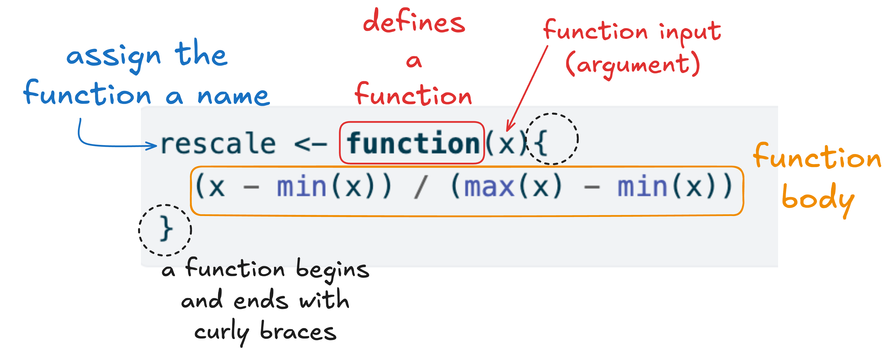
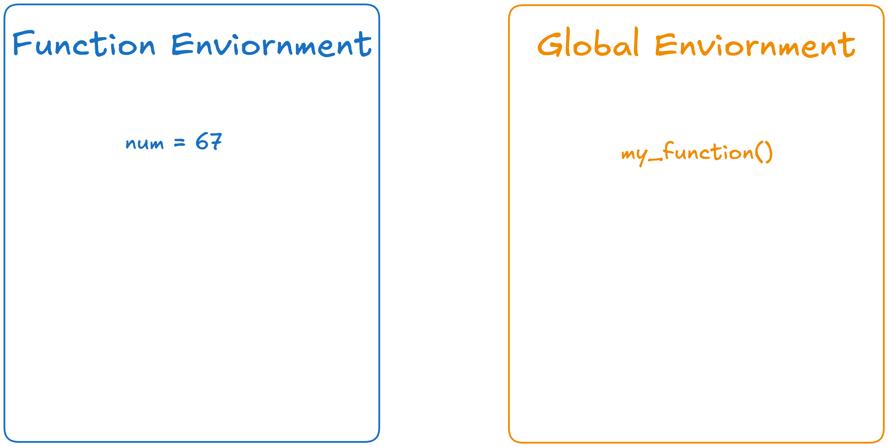
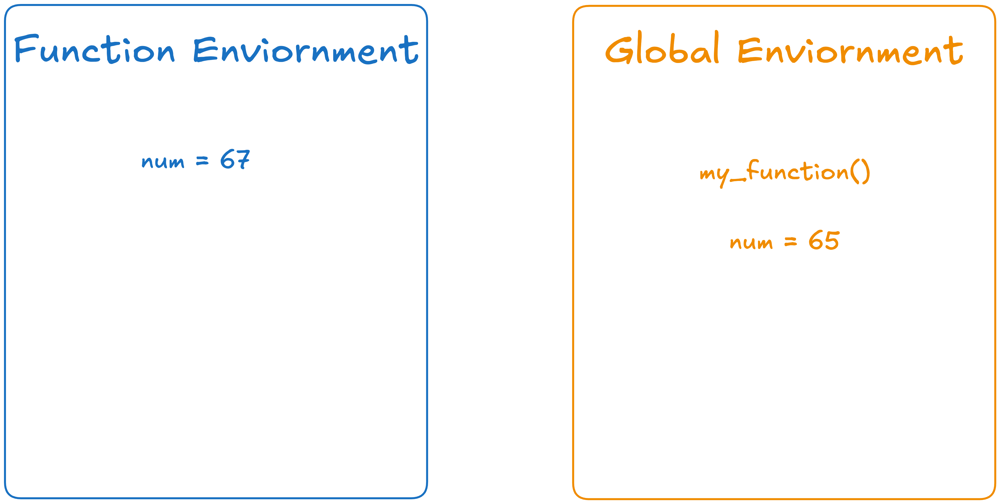
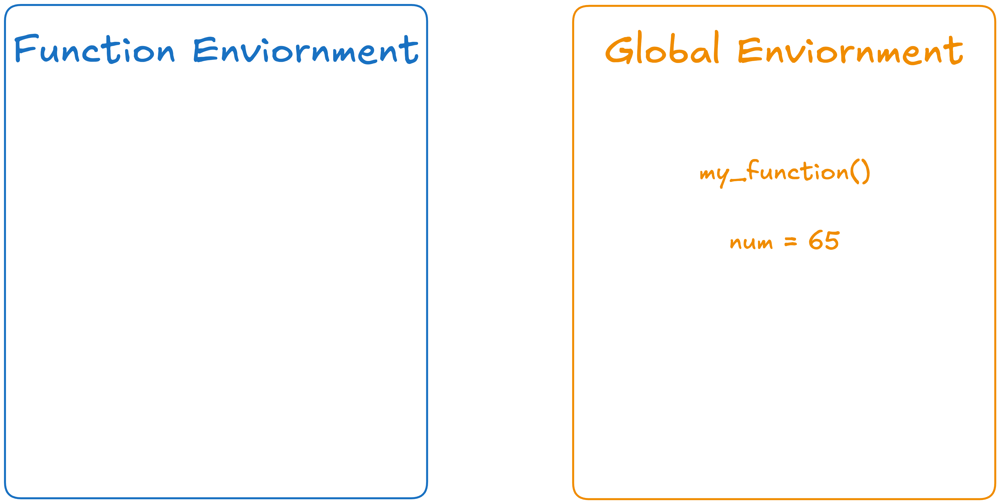

---
filters:
 - flourish
---

# Writing Simple Functions in R

::: callout
## Learning Objectives

- Understand the components of a function
- Outline how function arguments are used
- Write simple functions with vector input and output
- Practice unit testing custom functions
- Illustrate how `if()` statements can be used inside a function body
- Illustrate how loops can be used to call a function many times
:::

<!-- Functions they've seen so far: -->
<!-- typeof() -->
<!-- as.character() -->
<!-- as.numeric() -->
<!-- c() -->
<!-- matrix() -->
<!-- list()  -->
<!-- data.frame() -->
<!-- seq() -->
<!-- sqrt() -->
<!-- length() -->
<!-- sum() -->
<!-- case_when() -->
<!-- print() -->

At this point, you've encountered almost 20 functions either built-in to R 
(e.g., `sqrt()`) or that live in specific packages (e.g., `case_when()`). For
each function, we've learned how we can use it to get the results we were after,
but we haven't dug into what makes a function a function. That's what this
reading is about!

When you use an existing function, you have three key components to understand.

1. What is the **name** of this function?  e.g. `sqrt()`, `case_when()`,
`median()`. Remember that the name was chosen by the human that wrote that
code---you can usually guess what the function will do from the name, but you 
can't know for sure without reading the *documentation*!

2. What are the **arguments** of this function?  That is, what information do
you,
the user, have to give to the function to make it calculate something for you?
For example, `median(x = 1:10, na.rm = TRUE)` has two arguments: `x`, which
supplies the *vector* we want the median value of, and `na.rm`, which tells the
function how to handle missing data.

3. What **package** does this function come from?  You may have to load an
external library, such as `dplyr` to be able to use the function.

### Function Arguments

So far in this course, we've been modeling how we believe functions should be
used. Specifically, we've been using **named arguments** when calling the
function for every argument except the very first one 
(e.g., `median(1:10, na.rm = TRUE)`). Technically, using the name of the
argument (`na.rm = TRUE`) is not required. In fact, this code will still run:

```{r}
median(1:10, TRUE)
```

However, someone reading the code would have **no clue** that the `TRUE` 
argument was associated with deciding whether the NA values should be removed!
So, while the names of the arguments are not required, using named arguments 
makes your code more readable / understandable.

Let's explore what happens when we rearrange the order of the arguments. 
What if we specified `na.rm` first?

```{r}
median(na.rm = TRUE, x = 1:10)
```

The code still works! The code works because R is relying on the **names** of 
the arguments and not the **order** of the arguments. But what if we didn't use
the names of the arguments?

```{r}
#| error: true

median(TRUE, 1:10)
```

Uh oh! Why did we get a strange error here? Well, `median()` is assuming the
second argument is associated with `na.rm`. So, R thinks `na.rm = 1:10` and
`x = TRUE`. However, `na.rm` needs to be `TRUE/FALSE`, not a numeric vector, so
the function breaks!

So, what's the takeaway? Always use named arguments, then you don't need to 
memorize what order the arguments should be specified! However, it's generally
also okay to omit the name from the *first* argument, if you make sure to be
consistent about putting it first.

::: callout-check-in
Suppose `divide()` is a function with three arguments: 

1. `x`, a number
2. `y`, a number
3. `round`, a logical (`TRUE/FALSE`) value

The function calculates `x/y` and then decides whether or not to round the
result (depending on whether `round = TRUE` or `round = FALSE`). 

We want to calculate `17/3` and then round the result. For each of the
*function calls* below, indicate if this would result in

(a) An error
(b) No error, but an incorrect result
(c) The correct result

1. `divide(17, 3, TRUE)`
<!-- correct -->

2. `divide(round = TRUE, y = 3, x = 17)`
<!-- correct -->

3. `divide(17, 3, round = TRUE)`
<!-- correct -->

4. `divide(round = TRUE, 3, 17)`
<!-- incorrect, no error -->

5. `divide(TRUE, 17, 3)`
<!-- error -->
:::

## Custom Functions: Motivation

Instead of using existing functions, what if we want to write our *own* special
functions?  You might wonder why this would ever be necessary, since so many
R functions already exist.  Consider the following setting for a data analysis:

It is common in statistics and data science to need to rescale a variable before
including it in a model. Rescaling is quite helpful when variables are on very
different scales. In fact, for some machine learning methods (e.g., k-nearest
neighbors) it is critical that **every** variable be on the same scale for an
analysis.

Take for example, some common measures of the economy. The consumer price index
(CPI) measures the yearly change in price for a representative basket of goods
and services[^03-functions-1] and is recorded as a weighted average of prices 
(e.g., \$250). Alternatively, the PPI (producer price index) measures the yearly
change in prices paid to domestic producers of goods and services (e.g., \$120).
Finally, the PCE (Personal Consumption Expenditures) is a slightly broader
measure than CPI in that it attempts to measure both how much households are
spending (e.g., \$14,000) and what they're spending their money on.

[^03-functions-1]: [The Bureau of Labor Statistics (BLS)](https://www.bls.gov/cpi/questions-and-answers.htm) has a database of over
80,000 prices which they sample monthly for more than 200 categories of products
and services to determine the CPI and inflation rate. The BLS uses a huge basket
because its goal is to get an accurate measure of price changes for consumer
goods and services across the U.S. economy.

<!-- Data obtained from https://fred.stlouisfed.org/ -->

:::::::::: columns
::: {.column width="23%"}
```{r}
#| label: economy-year

year <- c(2020, 
          2021, 
          2022, 
          2023, 
          2024, 
          2025)
```
:::

::: {.column width="2%"}
:::

::: {.column width="23%"}
```{r}
#| label: economy-cpi

cpi <- c(258.811, 
         270.970, 
         292.655, 
         304.702, 
         313.689, 
         321.943)
```
:::

::: {.column width="2%"}
:::

::: {.column width="23%"}
```{r}
#| label: economy-ppi

ppi <- c(119.24, 
         119.46, 
         127.82, 
         139.98, 
         142.80, 
         146.16)
```
:::

::: {.column width="2%"}
:::

::: {.column width="25%"}
```{r}
#| label: economy-pce

pce <- c(14231.33,
         16119.67,
         17690.02,
         18833.15,
         19896.01,
         20954.86)
```
:::
::::::::::

<!-- Since we have economic measures for each year[^03-functions-2], let's assemble -->
<!-- them into a dataframe: -->

<!-- [^03-functions-2]: If we have vectors that are the **same** length, then each -->
<!-- vector can be a column of a dataframe. If they were *different* lengths we would -->
<!-- need to use a list to store them all together! -->

<!-- ```{r} -->
<!-- economy <- data.frame(year = year,  -->
<!--                       cpi = cpi,  -->
<!--                       ppi = ppi,  -->
<!--                       pce = pce) -->

<!-- economy -->
<!-- ``` -->

Notice how each of these variables are on different scales? Well, that's exactly
why we might want (need) to rescale them!

### Min-Max Scaling

One common method for rescaling is called "min-max scaling." For any numeric
vector, this method finds the maximum value and the minimum value and then uses
these values to rescale each value of the vector. Mathematically, each $i^{th}$
value of a vector $x$ is scaled based on this calculation:

$$\frac{x_i - min(x)}{max(x) - mix(x)}$$ For example, if we have a vector `x`
with values `c(1, 2, 5, 7)`. Then the minimum of `x` is `1` and the maximum of
`x` is `7`. We then use these values to rescale every value of `x`. This would
look like the following code:

```{r}
#| label: example-min-max

x <- c(1, 2, 5, 7)

(x - min(x)) / (max(x) - min(x))
```

Notice that the minimum value is now 0 because `1 - 1` is 0 (the minimum is 1) 
and the maximum value is now 1 because `(7 - 1) / (7 - 1)` (the maximum is 7). 

We could rescale every column of `economy` using the same code as above:

```{r}
#| label: repeated-rescaling
#| eval: false

cpi <- (cpi - min(cpi)) / (max(cpi) - min(cpi))
ppi <- (ppi - min(ppi)) / (max(ppi) - min(cpi))
pce <- (pce - min(ppi)) / (max(pce) - min(pce))

```

There are a couple of issues with this process. By repeating this same process
multiple times, it is harder to understand what the code is doing **and** we've
made our code more error prone. Did you notice the errors we made?

A better method would be to write a function that allows us to implement this
process anytime we want to rescale a numeric vector!

### Don't Repeat Yourself

The critical motivation behind writing your own functions is the "don't repeat
yourself" (DRY) principle. In general, "you should consider writing a function
whenever copied and pasted your code **more than twice** (i.e. you now have 
three copies of the same code)" ([Wickham, Çetinkaya-Rundel & Grolemund, 2020](https://r4ds.hadley.nz/functions.html#introduction)).

One of our favorite papers, [*Best Practices for Scientific Computing*](https://journals.plos.org/plosbiology/article?id=10.1371/journal.pbio.1001745),
summarizes this idea in a slightly different way:

> Anything that is repeated in two or more places is more difficult to maintain.
> Every time a change or correction is made, multiple locations must be updated,
> which increases the chance of errors and inconsistencies. To avoid this, 
> programmers follow the DRY (Don't Repeat Yourself) Principle.

The DRY Principle advocates that you *modularize* your code---break it into
smaller, independent, and reusable units. Modularizing your code helps you 
understand what your code is doing and makes your code more easily re-purposed
for other projects.

## Functions

We've been using functions for weeks now, but we haven't dug deep into how they
are built.

### Syntax

The first hurdle to learning to write a function in a programming language is 
figuring out what syntax you should use. In R, a function is defined using
`function()` and has the following syntax:

```{r}
#| label: function-syntax

rescale <- function(x) {
  (x - min(x)) / (max(x) - min(x))
}
```

Let's break this down into pieces:

{fig-alt="Basic syntax of a function in R. The function 'rescale' is assigned using '<-' to 'function(x)'. The function has one argument, x, which is dilineated with a red arrow and an annotation stating 'function argument (input)'. The body of the function is enclosed in curly brackets which are circled with dashed black lines. Inside the brackets, there is a single line of code '(x - min(x)) / (max(x) - min(x))' which is higlighted in orange with an annotation stating that this code represents the 'function body'."} 
</br>

**Function Name:** When you are reading the code above, the first thing you see
is the **name** of the function (`rescale`). This name is chosen by the user, so
we could have equally chosen to name the function `banana`. However, that seems
like a bad name since it doesn't indicate what the goal of the function is. In
general, we advocate to [use verbs as function names](https://style.tidyverse.org/functions.html#naming) where the verb
describes what the function does.

**Function Arguments:** Inside the `()` after `function` is where the
*arguments* (inputs) of the function are defined. All inputs you pass into 
a function are called arguments. Here we have one argument
(`x`), but we will learn how to incorporate more than one argument.

**Function Body:** After the `function(x)` there is a `{` which starts the 
*body* of the function. The body of the function is everything contained between
the opening `{` and the closing `}`.

**Function Parameter:** A *parameter* is the name of an object once is is 
inside the function. This might sound a bit confusing, `x` is both an *argument*
(input) to the function but also a *parameter* inside the function. We won't 
be upset if you get the two names swapped, but think you should know the
language people typically use when referring to these objects. 

<!-- [^2: This type of function is not the only type in R: they are called closures (a name with origins in LISP) A closure has three components, its formals (its argument list), its body (expr in the ‘Usage’ section) and its environment which provides the enclosure of the evaluation frame when the closure is used.] -->

**Beginning & Ending the Function:** Similar to other code styling principles
we've learned, the guideline is for the opening `{` to be the *last* character
on the line and for the closing `}` to be placed on its own line. These 
guidelines are to make your code easier to read / understand. The code below
accomplishes the same task as above but is harder to read / understand what is
happening:

```{r}
#| label: bad-function-style
#| eval: false

rescale <- function(x){ (x - min(x)) / (max(x) - min(x)) }
```


### Designing your own function

As you write more and more R code, you will get more used to recognizing moments
where a custom function is valuable, and to designing those functions.

For now, it may be helpful to break your function writing process down into a
few steps.

1. **Identify the need for a function.** Look for moments where the same *process*
is repeated on different *information*.  In our example, min-max scaling is the
process that was repeated on the three different variables.

```{r}
#| label: repeated-rescaling-again
#| eval: false

cpi <- (cpi - min(cpi)) / (max(cpi) - min(cpi))
ppi <- (ppi - min(ppi)) / (max(ppi) - min(pci))
pce <- (pce - min(pci)) / (max(pce) - min(pce))

```

2. **Identify the input.** What object(s) were used in the process? 
In our example, the only object was the *variable* that we wanted to scale. 
Choose a more general name for the input object, and rewrite your code using
this general name:

```{r}
#| label: intermediate-function-step
#| eval: false

x <- cpi
cpi <- (x - min(x)) / (max(x) - min(x))


x <- ppi
ppi <- (x - min(x)) / (max(x) - min(x))

x <- pce
pce <- (x - min(x)) / (max(x) - min(x))

```

3. **Choose a name for your function.**  Function names can use
capital or lowercase letters, numbers (except as the first character), and the
symbols `_` and `.`.  However, we recommend restricting yourself only to 
lowercase letters and the `_` symbol to avoid ambiguity. The name itself should
be a clear descriptor of what your function does, typically in verb form. In our
example, we chose `rescale`; another reasonable choice would have been 
`rescale_minmax`.

4. **Assign the function definition to the function name.** Following the syntax
rules described above, use your generic input as your *argument* and the
corresponding code as your *function body*.

```{r}
#| label: function-again

rescale <- function(x) {
  (x - min(x)) / (max(x) - min(x))
}
```

5. **Test your output.** Identify what type of object your function should 
return.  In this example, we want it to return a *numeric vector* that has the
same length as the original vector.  Make sure you **always** try your new function
on a small example **before** you use it in your analysis code.

```{r}
#| label: unit-test

test_vector <- c(1, 2, 3, 4)
rescale(test_vector)
```

You also may want to experiment a little bit with how this function could break!
Try input that:

* Is only one value instead of a vector, or vice versa.

* Contains missing values (`NA`)

* Is the wrong data type, e.g. *character* instead of *numeric*.

```{r}
#| label: unit-tests-errors
#| eval: false

test_single <- 5
test_missing <- c(1, 2, NA, 4)
test_type <- c("apple", "banana", "pear")

rescale(test_single)
rescale(test_missing)
rescale(test_type)
```

::: callout-check-in
Now that we have created the `rescale()` function, let's check our intuition
for what the function should output (return) for different inputs.

6.  What would you expect `rescale()` to output when `test_single` is input?
7.  What would you expect `rescale()` to output when `test_missing` is input?
8.  What would you expect `rescale()` to output when `test_type` is input?
:::

### Explicit Returns

A function output is often called a "return" because of 
its tie to a `return()` statement. You might wonder why you haven't seen a 
`return()` statement in a function yet and the answer is that `return()`
statements are a somewhat contentious topic among R programmers. We say
"contentious" because many programmers have staunch views of using a `return()`
statement, either for or against. We think you should be aware of these views so
you can decide which option you prefer.

**Option 1**: Using an explicit return

When we say "explicit return" we mean that there is a `return()` statement built 
in to the body of the function. This would look something like this:

```{r}
#| label: explicit-return

rescale <- function(x){
  x_scaled <- (x - min(x)) / (max(x) - min(x))
  return(x_scaled)
}

```

Notice how the results of the rescaling are saved into an object (`x_scaled`) and 
then the `return()` statement *explicitly* states that `x_scaled` should be returned 
(output). Here are a few pros and cons of this method!

:::::: columns
::: {.column width="48%"}
✅ Pros of Explicit `return()`

- Clarity and explicit intent
- Consistency with other languages (e.g., Python, Java, C)

<!-- - A `return()` statement is easy to see (it is printed as a different color in -->
<!-- RStudio), so it makes it easier to notice if your function is outputting what -->
<!-- you want it to.  -->
:::

::: {.column width="4%"}
:::

::: {.column width="48%"}
⚠️ Cons of Explicit `return()`

- More typing / slightly less idiomatic use of R
- Can be overused in simple functions
- Can complicate control flow unnecessarily

:::
::::::

**Option 2**: Not using an explicit return and instead using last value
calculated

This option effectively removes the `return()` statement from the function. 
Instead of using a `return()` statement, the function relies on R's behavior to 
return the last expression that was run.

```{r}
#| label: no-explicit-return

rescale <- function(x){
  (x - min(x)) / (max(x) - min(x))
}
```

:::::: columns
::: {.column width="48%"}
✅ Pros of Implicit Return (no `return()` statement)

- Concise and idiomatic
- Encourages "last expression" thinking
:::

::: {.column width="4%"}
:::

::: {.column width="48%"}
⚠️ Cons of Implicit Return

- Less obvious for beginners
- Harder to do early exits (i.e., your function ends early for certain inputs)
:::
::::::

**Choosing an Option**

As an R programmer, you will need to decide for yourself which of these two
options you prefer. It might be hard to know without trying what option you 
would prefer, so we encourage you to play around and try both!

The key is that you must be mindful to not mix and match methods between the
two. Take for example a classic function writing mistake:

```{r}
#| label: save-object-no-return
#| eval: false

rescale <- function(x){
  x_scaled <- (x - min(x)) / (max(x) - min(x))
}
```

If we were to try and use this function to rescale a vector (e.g., `rescale(y)`)
nothing would be output. That is because the rescaled values are saved into an
object (`x_scaled`) but never returned.[^1]

[^1]: This is a bit of a lie; if a function does not have
an explicit return or an output value, if defaults to *silently* returning the 
last stored object.  However, functions like this are extremely unclear, since 
nothing prints out when you call them - you should avoid creating functions that 
rely on this behavior.

::: callout-note
# Consistency with code style guide

Technically, the code style guide we've been using takes an anti explicit return
stance. If you want to hear more about their thinking, you can look at 
[these examples](https://style.tidyverse.org/functions.html#return).
:::


## Control Flow and Functions

Now that we have practiced creating simple functions, let's revisit how control
flow can be used to create more nuanced code processes.

### `if()` statements in functions

The DRY principle tells us we should avoid repeating similar code as much as
possible.  Another motivation for functions is to make our primary code more 
*readable*.

Consider the example from the previous chapter, where we calculated income tax rates.

```{r}
#| label: income-if-else
#| eval: false

if (income < 11925) {
  0.10
} else if (income <= 48475) {
  0.12
} else if (income <= 103350) {
  0.22
} else if (income <= 197300) {
  0.24
} else if (income <= 250525) {
  0.32
} else if (income < 626350){
  0.35
} else {
  0.37
}
```

This is a lot of lines of code, with a lot of very specific numeric values in them. 
We can make this cleaner by defining a function that runs the whole process when
called.  

We already have identified our *input* to the function: the object `income`, 
which should be a single numeric value.

All we need to do now is pick a reasonable name, then **wrap** the code in 
proper function definition syntax.

```{r}
#| label: income-tax-function

find_tax_rate <- function(income) {
  if (income < 11925) {
    0.10
  } else if (income <= 48475) {
    0.12
  } else if (income <= 103350) {
    0.22
  } else if (income <= 197300) {
    0.24
  } else if (income <= 250525) {
    0.32
  } else if (income < 626350){
    0.35
  } else {
    0.37
  }
}
```

Now, we try out our function for a few incomes:

```{r}
#| label: income-tax-function-call

find_tax_rate(611203)
find_tax_rate(795000)
find_tax_rate(45000)
```

::: callout-check-in
Let's think about what you would expect the `find_tax_rate()` function to do 
for different scenarios.

9.  What would you expect `find_tax_rate()` to output when a *character* object
is input?  Why?
10.  What would you expect `find_tax_rate()` to output when no arguments are
provided? Why?
11.  What would you expect `find_tax_rate()` to output when a numeric **vector**
is input? Why?
:::

### Vectorized functions

Thus far, we have seen two types of functions:

1. `rescale()` applied a process to a *vector* of values.

2. `find_tax_rate()` applied a process to a *single* value.

Recall that a **vectorized** operation is one that, when given a vector,
applies the operation to *each element* of the vector and returns the results.

Neither `rescale()` nor `find_tax_rate()` is a vectorized function!  

`rescale()` does take a vector as input, but it applies a process to *the whole
vector at once*, not to one element at a time.  That is, we could not replace
this code:

```{r}
#| label: rescale-vector

rescale(c(1, 2, 3))
```

with this code:

::: columns
::: {.column width="30%"}
```{r}
#| label: rescale-singletons

rescale(1)
```
:::

::: {.column width="3%"}
:::

::: {.column width="30%"}
```{r}
#| label: rescale-singletons-2

rescale(2)
```
:::

::: {.column width="3%"}
:::

::: {.column width="30%"}
```{r}
#| label: rescale-singletons-3

rescale(3)
```
:::
:::

As for `find_tax_rate()` we have already seen in previous readings that we get the error message 
`"the condition has length > 1"` when a vector is entered into an `if()`
statement.  In function form, this same error is still triggered.

```{r}
#| label: tax-rate-vector-error
#| error: true

incomes <- c(611203, 795000, 45000)
find_tax_rate(incomes)
```

As before, the only way to make a *non-vectorized* function that takes a single
input become *vectorized* is to take advantage of existing vectorized operations
in R. Recall from last chapter that the `case_when()` function from the
**dplyr** package allows us to take our `if`, `else if`, and `else` control flow
that only works on a single element (vector of length 1) and convert it into a
control flow that works on a vector of values!

```{r}
#| label: tax-rate-vectorized

library(dplyr) # needed to load case_when function

find_tax_rate_vectorized <- function(income) {
  
  case_when(income < 11925 ~ 0.10, 
          income <= 48475 ~ 0.12, 
          income <= 103350 ~ 0.22, 
          income <= 197300 ~ 0.24, 
          income <= 250525 ~ 0.32, 
          income < 626350 ~ 0.35, 
          .default = 0.37
          )
  
}
```

Now our function should be able to find the tax rate for every element of a
numeric vector.

```{r}
#| label: taxes-for-vector

incomes <- c(611203, 795000, 45000)
find_tax_rate_vectorized(incomes)
```

### Loops and functions

What to do if we truly cannot vectorize our function, but we need to run it
on a long vector of values?  We can make use of *loops* to call the function 
many times.

For example, suppose we wanted to calculate the income tax rate for a long list
of employee salaries. We can use a `for` loop to repeat our non-vectorized
`find_tax_rate()` function many times.

```{r}
#| label: tax-rate-loop

incomes <- c(35500, 
             207600, 
             556300, 
             77200, 
             76200, 
             106110, 
             125400)

for (income in incomes) {
  
  print(find_tax_rate(income))
  
}
```

Here we have only printed out the seven tax rates, not stored them in a *vector*
object.  This is a major disadvantage of unvectorized functions---we can repeat
the function over many values, but we don't get back a new object containing all
our results.  Although there are certainly ways to solve this problem, they are 
more complicated than we wish to tackle at this stage. For now, we will stick 
with using built-in vectorized functions whenever possible!

::: callout-check-in
Suppose we want to use a *loop* to rescale the vectors `cpi`, `ppe`, 
and `pci`.  What should go in the blanks below?


```{r}
#| eval: false
#| flourish:
#| - target: 
#|     - "blah"
#|     - mask: true
#|     - style: "text-decoration: underline;"
#| - target-rx: 
#|     - "blahblah"
#|     - mask: true
#|     - style: "text-decoration: underline;"


economy_data <- list(cpi, ppi, pce)

for(i in blah) {                                       
  
  economy_data[[i]] <- rescale(economy_data[blahblah])     
  
}
```

:::

## Environment, Scope, Name Masking & Dynamic Lookup

Now that we know how functions behave it's time to learn some of the hidden 
details. Let's start with the concept of a function's environment. 

### Environment

A function has its own environment, a universe that gets opened when you 
run the function. A function's environment is separate from the 
*global environment*, which is where all the objects you've created live (i.e., 
all the objects that would appear in the Environment tab). We need to first 
understand how these environments differ before we learn how they can relate
to each other. 

Let's explore this with a simple function:

```{r}
#| echo: true
#| label: simple-function

my_function <- function(){
  num <- 67
  return(num)
}
```

Hopefully you've noticed something strange about this function---it has no
arguments. We've written the function this way so we can explore the difference
between a *function environment* and the *global environment*. 

What would you expect this code to return?

```{r}
#| eval: false

my_function()
```

If you guessed ``r my_function()`` you are correct! When we call `my_function()` 
it first creates an object called `num` that has the value `67` attached to it, 
and then returns the value of `num` (67). 

You might think that since `my_function()` creates an object `num` that you 
could use this object outside the function...

```{r}
#| error: true

num
```

but this object doesn't exist in the *global environment*, it only exists in
the *function environment*. 

<!-- to-do: "environment" is spelled wrong in all the images below -->

{fig-alt="An image with two boxes, one blue and one orange. The orange box is labeled global enviroment with 'my_function()' displayed below. This represents the function (object) that has been globally defined and is accessible to the user. The blue box is labeled function enviornment with 'num = 67' displayed below. This represents the object that has been created by the function (my_function) that IS NOT available to the global environment." width=70% fig-align="center"}

### Name Masking

But what if there was an object in the *global environment* that had the same
name as the object in the *function environment*?

```{r}
num <- 65
```

{fig-alt="The previous image with the global and function environments has been altered slightly. In this image there is one additional object included in the global environment (orange box). The object says 'num = 65'. The object (num) has the same name in the function environment and the global environment, but the value of the object differs." width=70% fig-align="center"}

What do you expect this code will return?

```{r}
#| eval: false

my_function()
```

If you guessed ``r my_function()`` you are correct! This is an example of what
is called **name masking**, where names (objects) defined inside of a function
mask names (objects) defined outside of a function. In this example, `num` has
the value of 65 *outside* the function, but *inside* the function `num` has a
value of 67. Functions operate as a closed system where they rely only on the
objects within the *function environment*, which is why `my_function()` returns
67 and not 65. 

### Dynamic Lookup

We just said "functions operate as a closed system," but that is not **always**
true. Functions [try]{.underline} to operate as a closed system, but sometimes
they need to ask for a little help. If we make a small modification to 
`my_function()`, you will see what we mean!

```{r}
#| echo: true
#| label: simple-function-bad-scope

my_function <- function(){
  return(num)
}
```

Notice, we've eliminated the line of the function where `num` was created 
(`num <- 67`). However, the function still returns the value of num. So, here's
our new system:

{fig-alt="The previous image with the global and function environments has been altered slightly. In this image the 'num = 67' object has been removed from the function enviornment. So, the fuction environment box (in blue) is empty. However, the 'num = 65' object remains in the global environment. Since the num object doesn't exist in the function environment, when the function is called it will need to rely on objects in the global environment." width=70% fig-align="center"}

Now what do you expect this code will return?

```{r}
#| eval: false

my_function()
```

If you guessed ``r my_function()`` you are correct! When an object doesn't exist
in the function's environment then it searches for that object in the global 
environment. If it can't find an object in the global environment, the function 
will error out. 

It is also important to note that because `my_function()` is relying on objects 
in the global environment, it is possible that the output can change. If we 
change the value of `num` in the global environment, then the output of 
`my_function()` will also change:

```{r}
num <- 13

my_function()
```

### So what does this all mean?

This is a lot of technical details, so you might be wondering what the big
picture is. Here are the three things you should know:

1. Objects created in a function **cannot** be accessed in the global
environment.

2. If an function can't find an object it is supposed to use within its 
environment (the function environment), then it will search for that object 
in the global environment. 

In general, we would recommend **not** using the same name for an object in
a function and an object in your global environment. For example, you shouldn't 
name your dataset `data` and then use a parameter `data` in your function.

::: callout-check-in
::: columns
::: {.column width="48%"}
Suppose we've created the following function:

```{r}

friend_or_foe <- function(){
  if_else(pet == "cat", 
          "friend", 
          "foe")
}
```
:::

::: {.column width="4%"}
:::

::: {.column width="48%"}
And we have the following value in our global environment:

```{r}
pet <- "cat"
```

:::
:::

13. What would `friend_or_foe()` output?

14. What if we ran the following code `pet <- "parrot"`? What would 
`friend_or_foe()` output?

15. What if there was no object named `pet` in the global environment? What 
would `friend_or_foe()` output?
:::
