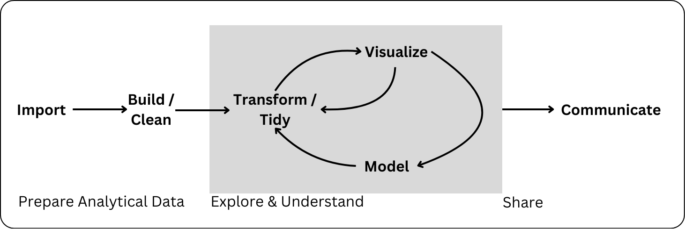
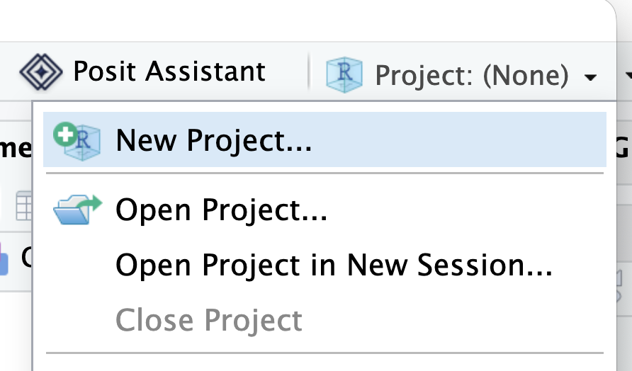
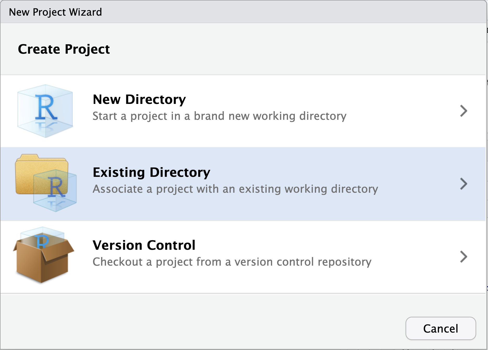
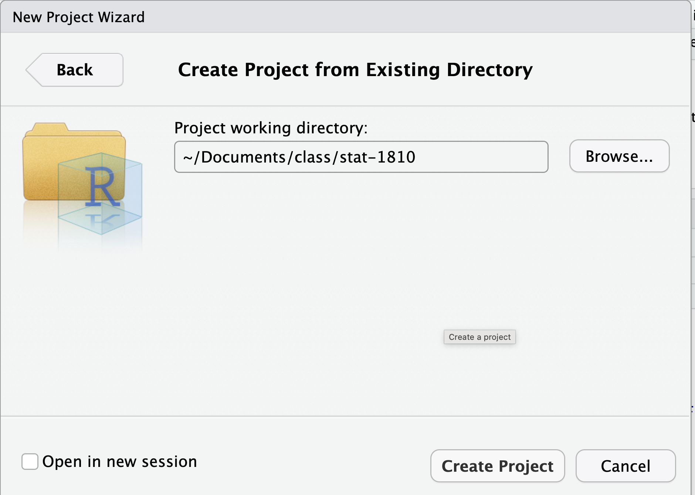
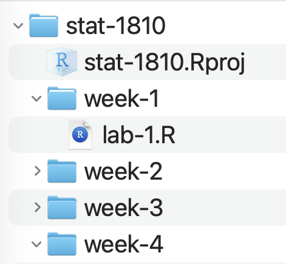
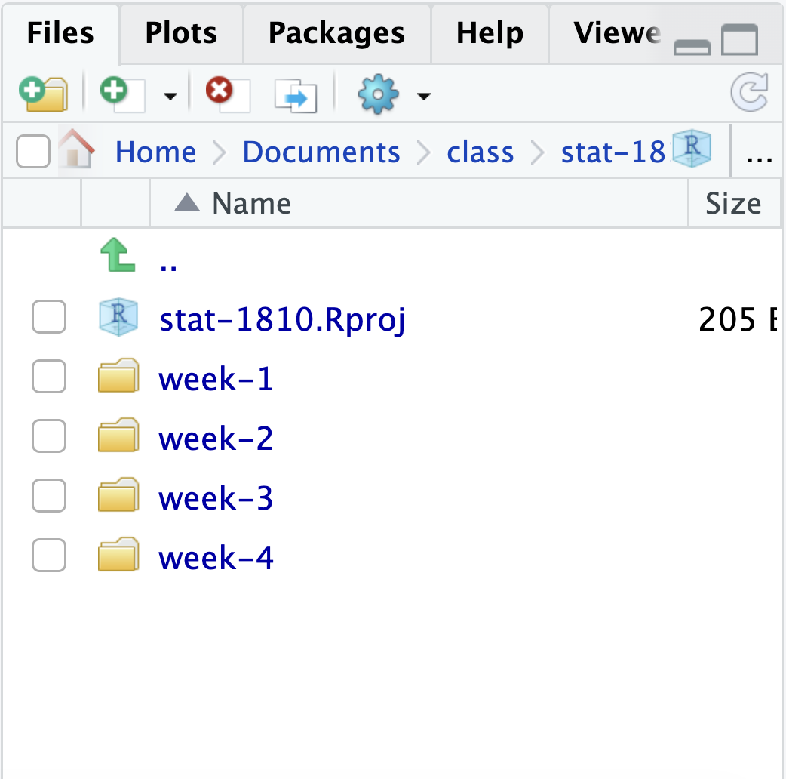
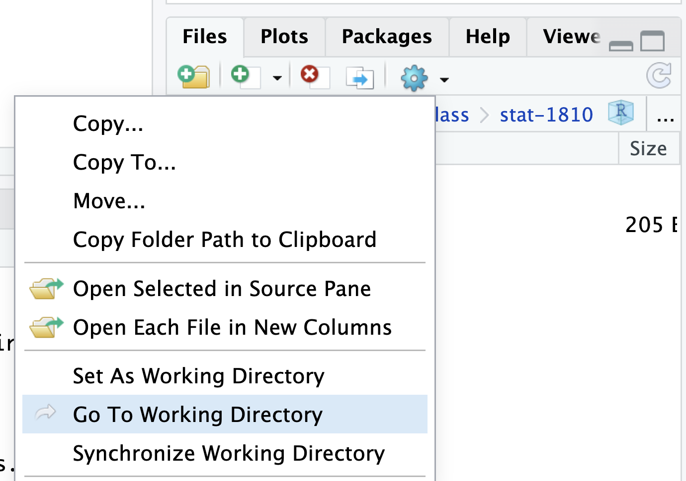

# Data is Friend {.unnumbered}


## Welcome to the tidyverse!

Since R is open source, there are many different options for functions that can accomplish the same task. Over time, full sets of functions and packages have been developed with the purpose of working well together for data analysis and visualization. 

In this class, we will use the *tidyverse* set of packages to visualize and wrangle data. This **decision** impacts the way that we will think about working with data (in a good way - in our opinion!). 

The developers of the *tidyverse* describe it as:

> an opinionated collection of R packages designed for data science. All packages share an underlying design philosophy, grammar, and data structures.[^1]

Most of the functionality you will need for an entire data analysis workflow will have the **cohesive grammar** of the tidyverse.

{fig-alt="Flow chart illustrating data science workflow. Moving from left to right, Import, right arrow, Build / Clean, right arrow, to a clockwise roatation of arrows in a grey background box and words from Transform / Tidy to Visualize to Model. Finally there is a right arrow after the box to the word Communicate."}


[^1]: https://www.tidyverse.org/


This week, we will, learn how to read in data (the "Import" step in the data science workflow) with `readr`, and we will continue to use lots of tools from the tidyverse throughout Unit 2!

### The `tidyverse` package

We said previously that the *tidyverse* is a **set** of packages. The developers
of the *tidyverse* built these packages to touch every step of the data science
workflow. Meaning, for a typical analysis we might need to load in the following
packages:

- `readr` or `readxl`(to import our data)
- `dplyr` (to transform our data)
- `lubridate`, `stringr`, and `forcats` (to work with special data types)
- `ggplot` (to plot our data)

That's a lot of packages! The *tidyverse* developers recognized this and made 
a shortcut. Instead to loading in each specific package, we can load in the
`tidyverse` package. When loaded, the `tidyverse` package will load the 
["core" *tidyverse* packages](https://tidyverse.org/packages/). 

We will always tell you what specific package the functions you are working 
with come from, but sometimes it is easier (i.e., fewer steps) to load in the 
`tidyverse` package rather that every specific package. 

## Getting Acquainted with Our Data

### Data Context

It is very easy (and tempting) once presented with a dataset to just start right into analyzing it, treating the data as a static source of "truth." However, all data is really an artifact of many decisions and influences, and you also probably are coming to data with some assumptions about it yourself, which are maybe different than someone else! This is why considering data context, including your relationship to the data, is a critical first step in working with any data.  

Let's think about some seemingly simple data about penguins in Antarctica. The **palmerpenguins** data were collected and made available by Dr. Kristen Gorman and the Palmer Station, Antarctica LTER, and compiled nicely for use in R by Allison Horst and Alison Hill. They have [great documentation](https://allisonhorst.github.io/palmerpenguins/) for the data. We will be using the `penguins` dataset that is a subset of this bigger dataset.

Going to the [original research article](https://journals.plos.org/plosone/article?id=10.1371/journal.pone.0090081#ack) that used this data, we can get some information about *why* the data was gathered, *who* gathered it and funded the work, and *how* they gathered it. 

The original research is described as investigating "ecological sexual dimorphism" among specific species of Antarctic penguins, and how their environments may impact this dimorphism. We will just be looking at some body measurements of the penguins---but it turns out it is part of this much more complex work that also involved chemical analysis of the penguin's blood!

We might note that the three primary researchers are from universities in British Columbia, Canada and Sheridan, Montana, so the field work was conducted outside of their communities. There are only researchers on Antartica, however, so this research would not have impacted any local communities of humans. But it is worth considering how this research might impact other animals in Antarctica? The research was funded by different grants from the National Science Foundation (NSF) in the US, with some logistical support by Raytheon Polar Services Company and Edison Chouest Offshore. The NSF does not typically apply an agenda to researchers, so it seems reasonable to assume that the research was conducted for academic purposes only, rather than to profit any companies.

The study describes nests on three islands---Biscoe, Torgersen, and Dream---which had two adult penguins. However, the study does not specify how these nests were selected. This should cause us to wonder if these data represent all nests on these islands. Would this sampling method generate a random sample? A convenience sample? A stratified sample? Researchers captured the penguins to take measurements once one egg was laid in the nest.

This *might* feel like TMI, but all of this information impacts how we interpret the data!


### Rectangular Data

There are a lot of different ways that we can look at data in the world and store it on our computer. 

Let's keep thinking about the penguin data. First, the researchers had to mark, where all of their study nests were, maybe on a map! When the time came, they captured and took measurements from individual penguins, perhaps entering the information on a form on a clipboard or iPad. Measurements scribbled on a piece of paper **is data**. However, this is not in a great format for us to analyze on a computer. The measurements for all penguins were combined into a spreadsheet or *rectangle* of raw data. These data were cleaned up for our use in R!

 with an imagined map of study nests added. Image of a penguins beak being measured is from [another project.](https://i.imgur.com/rPYqNYh.jpeg).](images/04-penguins-data-creation.png)


In this class, we will primarily focus on working with what we call *rectangular data* meaning that the data are two-dimensional with rows and columns. With rectangular data, each *row* represents one observation (or observational unit) and each *column* represents a data *variable*. Note that this definition of "variable" is distinct from the *environmental variables* you've been making for the last three weeks (e.g., `x <- 3`)! Throughout this course, while talking about rectangular data, we may use "column" and "variable" interchangeably to discuss data variables.

There are also multiple ways that rectangular data can be stored in R! We will primarily work with `data.frame()` and `tibble()` objects. It is important to know the type and format of the data you're working with! It is much easier to create data visualizations or conduct statistical analyses if the data you use is in the right shape. 


In a perfect world, all data would come in the right format for our needs, but this is often not the case. We will spend the next few weeks learning about how to use R to read in data and reformat our data so that it can be used in a specific analysis.

### Data in R

You were introduced briefly to dataframes and how to index them in @sec-2-dataframes and @sec-2-dataframe-index. Tibbles are just dataframes with some extra fancy features---but you can treat them interchangeably for now!

It is always useful to actually **look at your data** before beginning to work with it to see the format of the data. The following functions in R help us learn information about our data sets:

+ `class()`: outputs the object type
+ `names()`: outputs the variable (column) names
+ `head()`: outputs the first 6 rows of a dataframe
+ `glimpse()` or `str()`: output a transpose of dataframe or matrix and shows the data types of each column
+ `summary()` outputs 6-number summaries or frequencies for all variables in the data set depending on the variables data type
+ `data$variable`: extracts a specific variable (column) from the data set

You can also double-click on the dataset name in your Environment window pane and the dataset will open in the data viewer (looks like Excel). 

::: {.callout-opinion}

When you have a dataset with many rows and columns, you can't get the full picture just opening the dataset from the Environment, but we often start there just to get an initial grasp on the data!

:::

Let's start with looking at a dataset that is included in a *package* in R. 

The `penguins` data is included with the **palmerpenguins** package in R. Our 
first step with any new package is to install it! There are two ways to go
about this:

1. Run this code in the console:

```{r}
#| eval: false
#| label: install-packages-code

install.packages("palmerpenguins", dependencies = TRUE)
```


2. Click on the Packages tab, click on the Install button (upper left), type
`palmerpenguins` in the Packages line, check the "Install dependencies" box, 
and click Install.

We only need to install the package **once**. After installing, we can use the
package whenever we want so long as we tell R we want to use it. We do this 
by **loading** the package with the `library()` function. 

```{r}
# load palmerpenguins package
library(palmerpenguins)
```

Now that we have the `palmerpenguins` package loaded, let's start by just 
looking at the `penguins` data.

```{r}
# look at the first couple of rows
head(penguins)

# get a preview of the variables and their data types
str(penguins)
```

The following questions should be crossing your mind when you are first looking at this data:

1. What does a *row* in the data represent?

2. What kinds of *variables* are available in the data? How many are there?

3. What data types are each of the variables? Does that data type make sense?

4. What questions do you have about the variables after just looking at the data itself?


Just looking at a data frame in R, we can't tell how the variables are measured and what they all mean! We will always want to look at a **data dictionary** to understand what the data really means and the context of the data, as we discussed above. Any good data provider should provide a data dictionary along with the data!

In this case, in addition to the [nice documentation](https://allisonhorst.github.io/palmerpenguins/) we already looked at online we can find the data dictionary in the help file for the data since it is a dataset built into an R package. 

When we type `?penguins` into the Console, a page that looks like this should appear in the Help tab:

{width=70% fig-align="center"}

The description of the dataset in this dictionary is:

> Size measurements for adult foraging penguins near Palmer Station, Antarctica

> Includes measurements for penguin species, island in Palmer Archipelago, size (flipper length, body mass, bill dimensions), and sex. This is a subset of `penguins_raw`.

This gives us a better idea about what we are working with. Each row in the data specifically represents an adult foraging penguin from near Palmer Station, Antarctica. 

The data dictionary also helpfully tells us the variable type, a short descriptions, and the possible values or the units for each variable (e.g., `bill_depth_mm` is measured in millimeters, the years are either 2007, 2008, or 2009). It also includes sources so that we could investigate the original, raw data if needed. We should use all of these resources to understand the full context of the data, as well as the individual variables and rows.

## Project and Data Management

### RStudio Projects

In the previous weeks, our R script contained everything necessary for our 
analysis. This week, we've expanded our analysis to include data. Thus, it is
important for us to start thinking more about how our files are organized. 

Having each analysis well organized and separate from other analyses is such a fundamental part of good data science, that RStudio built a tool to help---RStudio **projects**.

We love RStudio projects for two reasons:

1. They create a clear organizational structure to every analysis 
2. They allow you to easily navigate between projects / analyses

You can create an RStudio project with a new directory (i.e., a new folder) 
or add a project to an already existing directory (i.e., a folder that already
exists on your computer). Since you already have a designated `stat-1810` folder
that you've stored all your work in thus far, let's create an RStudio project
in this folder. 

**Follow the steps that follow to create a `stat-1810` Rstudio project in your `stat-1810` directory.**

:::panel-tabset

## Step 1

There are a couple of different ways to create a new RStudio project, but we will just walk through one.

- First, make sure you have an RStudio window open.
- Click on the project icon at the top right corner of the window.
- Select "New Project" from the drop-down options.

{width=50%}

## Step 2

The screen shown below should pop up.

Since you already have a `stat-1810` directory, that we want to convert into a project, select the "Existing Directory" option.


{width=70%}

## Step 3

- Click the "Browse" button and navigate to your `stat-1810` directory (it should be in your Documents).

  - In the example shown below, the `stat-1810` folder lives inside of the `class` folder, within the `Documents` folder.

- Once you have given the path to you `stat-1810` directory, click "Create Project"

{width=70%}

## You Made A Project!

Your Rstudio window should look a little different now!

- The name of your new project (`stat-1810`) is now showing in the top right, project dropdown.
- The Files tab is now showing your project directory.
- There is a `stat-1810.Rproj` file in the directory.


:::


When you convert a directory into a RStudio project, you will notice that a `.Rproj` file now exists in that directory. This is reflected both in your file manager (Finder on Mac and File Explorer on PC) and in the Files tab in RStudio:

::: {layout-ncol=2}
{width=90%}

{width=90%}


:::


For the rest of the course, you should always be working with your `stat-1810` RStudio Project! To open your project, you can either:

1. Double click the `stat-1810.Rproj` file (the blue cube) in your file manager on your computer, or
2. Navigate to the project using the the drop-down in the top right corner of RStudio.

Practice closing your project and reopening it using one of the methods above. You should notice that when you re-open a project, you will end up exactly where you left off! Any files you had open the last time you worked in the project will be open and any previously run code is in the Console. 

<!-- Allison: I don't know if this is true. Will the file(s) that were open before reopen? Will the code that was run before still be in the Console? -->

Now we are all set up with an RStudio project that will include all of the data, scripts, and outputs from our analysis. A final step to having a good and reproducible analysis workflow is to think carefully about how all of these files reference each other!

### File Paths Refresher

As you learned in @sec-0-file-paths, a **file path** describes where a certain file or directory lives on your computer.  There are two different kinds of file paths that you can define to indicate the location of a file or directory:

- **absolute file path**: full path from the root directory on *your* computer. Note this will only work on your computer because no one else has the same username as you!

- **relative file path**: path based on the relationship with a current *working directory* in terms of a hierarchy of directories 

In order to create reproducible analysis (that could be run on someone else's computer), we **always use relative file paths**. To write relative files paths, you need to know what your *working directory* is.

#### Absolute vs. Relative File Paths Examples

Let's look at an example of relative versus absolute file paths. In the example below the `"labs"` directory is the working directory. The directories that `"labs"` are in are called it's *parent* directories, which are referenced with `"../"` in the relative file paths.


### Working Directory

Any time that you open R, it sets a *working directory*. A working directory 
is the baseline directory (folder) that R is looks for files. 

:::panel-tabset
## Find WD

You can find your current working directory by running the following code in 
your Console:

```{r}
getwd()
```

<!-- Allison: When would we want to use this? I worry this might be too confusing. -->
## Go to WD

Another thing you might want to do is navigate to your working directory in the Files tab in RStudio. 

- In the Files tab, select the blue settings gear
- Select "Go To Working Directory" from the drop-down.

{width=70%}

:::

Both Quarto documents and RStudio projects help us manage the working directory automatically!

**RStudio projects** set the working directory as the main project directory (i.e. where the .Rproj file lives). That will thus be your working directory if you are writing and running code in:

- R scripts or
- the Console

::: {.callout-warning}
# Quarto Files

The working directory in **Quarto** files (.qmd) is where the Quarto file lives
(not where the `.Rproj` lives)! This might seem tricky, but we generally 
remember that Quarto always wins ☺️. 
:::

For example, the `stat-1810` RStudio project sets the working directory to be the `stat-1810` directory (as indicated with the stars in @fig-proj-wkdr) for code run in any R scripts like `lab-1.R` or if we run code in the Console. However, if we are working in `pa4.qmd`, the project is overridden and the working directory is `week-4` (@fig-quarto-wkdr).

::: {layout-ncol=2}

{#fig-proj-wkdr width=90%}

{#fig-quarto-wkdr width=90%}

:::


