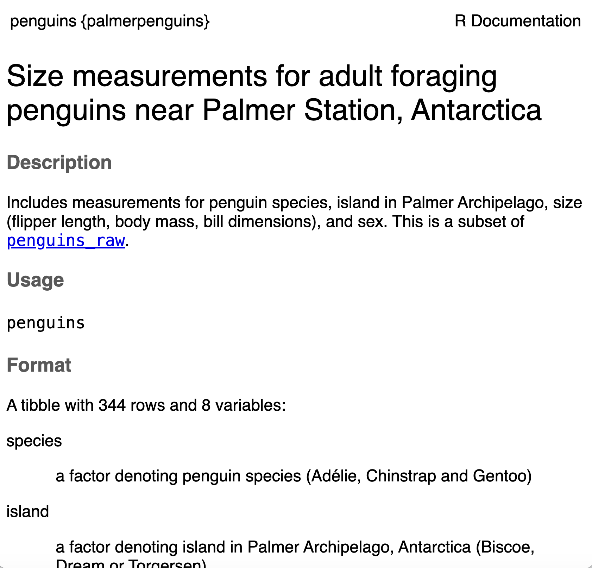
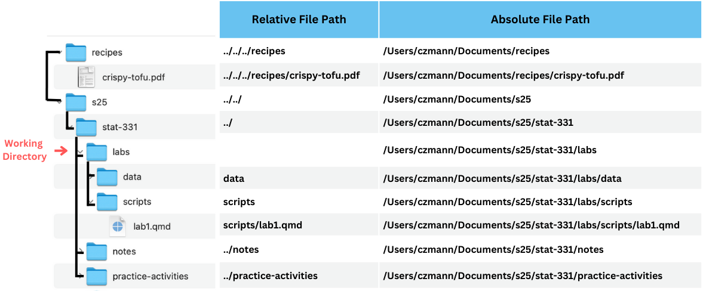

# Data is Friend {.unnumbered}


## Welcome to the tidyverse!

Since R is open source, there are many different options for functions that can accomplish the same task. Over time, full sets of functions and packages have been developed with the purpose of working well together for data analysis and visualization. 

In this class, we will use the *tidyverse* set of packages to visualize and wrangle data. This **decision** impacts the way that we will think about working with data (in a good way - in our opinion!). 

In their own words, the *tidyverse* developers describe it as:

>an opinionated collection of R packages designed for data science. All packages share an underlying design philosophy, grammar, and data structures.[^1]

Most of the functionality you will need for an entire data analysis workflow will have the **cohesive grammar** of the tidyverse.

{fig-alt="Flow chart illustrating data science workflow. Moving from left to right, Import, right arrow, Build / Clean, right arrow, to a clockwise roatation of arrows in a grey background box and words from Transform / Tidy to Visualize to Model. Finally there is a right arrow after the box to the word Communicate."}


[^1]: https://www.tidyverse.org/


This week, we will, learn how to read in data (the "Import" step in the data science workflow) with `readr`, and we will continue to use lots of tools from the tidyverse thorughout Unit 2!

### The `tidyverse` package

Another nifty part of the *tidyverse* is that there is a `tidyverse` package. When installed or loaded, the ["core" *tidyverse* packages](https://tidyverse.org/packages/) are also installed or loaded. This means, that you often **only** need to load the `tidyverse` package (`library(tidyverse)`) in a script!

## Getting Acquainted with our Data


### Data Context

[[TO-DO]]

- ethics discussion
- look at context of penguins data


### Rectangular Data

There are a lot of different ways that we can look at data in the world and store it on our computer. 

 - THINK ABOUT HOW PENGUINS DATA MIGHT HAVE BEEN COLLECTED?? Was it a rectangle when they collected it?

In this class, we will primarily focus on working with what we call *rectangular data* meaning that the data is two-dimensional with rows and columns. With rectangular data, each *row* represents one observation (or observational unit) and each *column* represents a *variable*.


<!--CHECK FOR OVERLAP IN THIS SECTION and reference previous chapters-->

There are also multiple ways that rectangular data can be stored in R! We will primarily work with `data.frame()` and `tibble()` objects. It is important to know the type and format of the data you're working with! It is much easier to create data visualizations or conduct statistical analyses if the data you use is in the right shape. 

In a perfect world, all data would come in the right format for our needs, but this is often not the case. We will spend the next few weeks learning about how to use R to read in data and reformat our data so that it can be used in a specific analysis.

### Data in R

You were introduced briefly to dataframes and how to index them in @sec-2-dataframes and @sec-2-dataframe-index. Tibbles are just dataframes with some extra fancy features -- but you can treat them interchangeably for now!

It is always useful to actually **look at your data** before beginning to work with it to see the format of the data. The following functions in R help us learn information about our data sets:

+ `class()`: outputs the object type
+ `names()`: outputs the variable (column) names
+ `head()`: outputs the first 6 rows of a dataframe
+ `glimpse()` or `str()`: output a transpose of dataframe or matrix; shows the data types
+ `summary()` outputs 6-number summaries or frequencies for all variables in the data set depending on the variables data type
+ `data$variable`: extracts a specific variable (column) from the data set

You can also double-click on the dataset name in your Environment window pane in R and the dataset will pop up in a new tab in the script pane.

::: {.callout-opinion}

When you have a dataset with many rows and columns, you can't get the full picture just opening the dataset from the Environment, but I often start there just to get a grasp on the data!

:::

Let's start with looking at a dataset that is included in a *package* in R. 

The `penguins` data is included with the `palmerpenguins` package in R. This means that as long as the `palmerpenguins` package is loaded, we can also load the `penguins` dataset. 

Let's start by just looking at the data.

```{r}
# load palmerpenguins package
library(palmerpenguins)

# load penguins data which is included in the package
data(penguins)

# look at the first couple of rows
head(penguins)

# get a summary of the data
str(penguins)
```

The following questions should be crossing your mind when you are first looking at this data:

1. What does a *row* in the data represent?

2. What kinds of *variables* are available in the data? How many are there?

3. What questions do you have about the variables after just looking at the data itself?


Just looking at a data frame in R, we can't tell how the variables are measured and what they all mean! We will always want to look at a **data dictionary** to understand what the data really means. Any good data provider should provide a data dictionary along with the data!

In this case, we can find the data dictionary in the help file for the data since it is a dataset built into an R package:

```{r}
#| eval: false

?penguins
```

A page that looks like this should appear in the Help tab:



The description of the dataset in this dictionary is:

> Size measurements for adult foraging penguins near Palmer Station, Antarctica

> Includes measurements for penguin species, island in Palmer Archipelago, size (flipper length, body mass, bill dimensions), and sex. This is a subset of penguins_raw.

This gives us a better idea about what we are working with. Each row in the data specifically represents an adult foraging penguin from near Palmer Station, Antarctica. 

The data dictionary also helpfully tells us the variable type, a short descriptions, and the possible values or the units for each variable. It also includes sources so that we could investigate the original, raw data if needed! 


## Reading in External Data

### File Paths Refresher

Before we can read in data, we need to tell R where to look for the data file!

- need to edit this to align with other chapter / remove repetitive things

A **file path** describes where a certain file or directory lives on your computer. Any time that you are working in R, there is a *working directory*, which is the baseline directory that R is then looking for other files from. You can find your current working directory with:

```{r}
getwd()
```

There are two different kinds of file paths that you can define to indicate the location of a file or directory:

- **absolute file path**: full path from the root directory on *your* computer. Note this will only work on your computer!

- **relative file path**: path based on the relationship with a current *working directory* in terms of a hierarchichy of directories 
 
Let's look at an example of relative versus absolute file paths. In the example below the "labs" directory is the working directory. The directories that "labs" are in are called it's *parent* directories, which are referenced with `"../"` in the relative file paths.


<!-- ### RStudio Projects -->

<!-- When you work on a project that may need to exist on some other machine, it's important to use **local** file paths -- the global path will likely not be the same, but you can usually set the local project-specific structure up to be the same across machines.  -->

<!-- In fact, there's a very common shortcut that programmers take -- they set up a project-specific folder that is self contained.  -->
<!-- That is, all of the data and code necessary for that project is provided within the folder.  -->
<!-- Then, the code within the folder can use local paths and will work when the project folder is copied to a new machine.  -->

<!-- (Allison) I'm not quite sure where this should go, but we will need to 
introduce packages in this lesson. -->

<!-- ### Packages tab -->

<!-- R and python both work off of packages - extensions to the default language that make it easier to accomplish certain tasks, like reading data from Excel files or drawing pretty charts.  -->
<!-- This tab shows all of the R packages you have installed on your machine, and which ones are currently loaded. -->

<!-- {fig-alt="Packages tab of RStudio. Checkboxes in the far left column show whether packages are loaded. Links to the package name can be clicked to access package documentation. The 3rd column is the package version, which should be verified and updated if you're having issues with the package's functions."} -->
