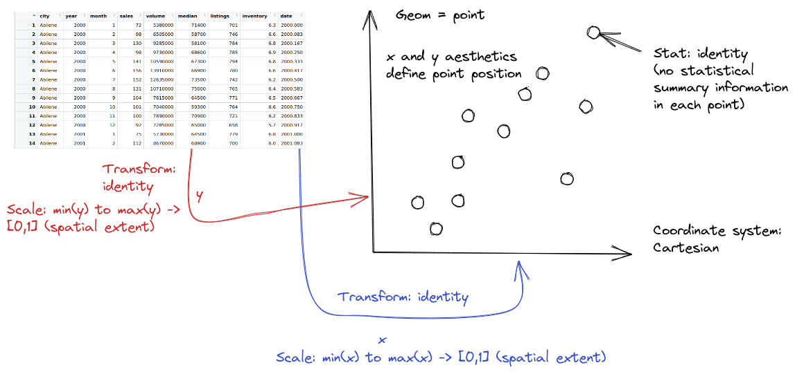

# Data Visualizations {.unnumbered}

<!-- https://r4ds.hadley.nz/data-visualize.html -->

::: callout-note
Under development. Removed python and simplified from Susan's reading.
:::

## Grammar of Graphics

Why do we create graphics?

> The greatest possibilities of visual display lie in vividness and inescapability of the intended message. A visual display can stop your mental flow in its tracks and make you think. A visual display can force you to notice what you never expected to see. ("Why, that scatter diagram has a hole in the middle!") -- John W. Tukey [@tukeyDataBasedGraphicsVisual1990]

Fundamentally, charts are easier to understand than raw data.

When you think about it, data is a pretty artificial thing. 
We exist in a world of tangible objects, but data are an abstraction - even when the data record information about the tangible world, the measurements are a way of removing the physical and transforming the "real world" into a virtual thing. 
As a result, it can be hard to wrap our heads around what our data contain. 
The solution to this is to transform our data back into something that is "tangible" in some way -- if not physical and literally touch-able, at least something we can view and "wrap our heads around".

::: {.callout-tip}
### Thought Experiment

You have a simple data set - 2 variables, about 150 observations. 
You want to get a sense of how the variables relate to each other. 
You can do one of the following options:

1.  Print out the data set
2.  Create some summary statistics of each variable and perhaps the covariance between the two variables
3.  Draw a scatter plot of the two variables

Which one would you rather use? Why?

::: panel-tabset

#### Dataset
```{r}
#| echo: false
# install.packages("datasauRus")
library(datasauRus)
library(dplyr)
datasaurus_dozen %>% filter(dataset == "dino") %>% select(x, y) %>% rmarkdown::paged_table() 
```

#### Summary statistics
```{r}
#| echo: false
datasaurus_dozen %>% filter(dataset == "dino") %>% 
  summarize(`mean(X)`    = mean(x),
            `mean(Y)`    = mean(y),
            `sd(X)` = sd(x),
            `sd(Y)` = sd(y),
            `corr(X,Y)`  = cor(x, y)
  ) %>%
  tidyr::pivot_longer(everything(), names_to = "Statistic", values_to = "Value") %>%
  rmarkdown::paged_table()
```

#### Plot
```{r}
#| echo: false
#| fig-width: 5
#| fig-height: 5
#| out-width: 50%
library(ggplot2)
datasaurus_dozen %>% filter(dataset == "dino") %>% 
ggplot(aes(x = x, y = y)) + geom_point()
```

:::

:::

Our brains are very good at processing large amounts of visual information quickly.
Evolution is good at optimizing for survival, and it's important to be able to survey a field and pick out the tiger that might eat you. 
When we present information visually, in a format that can leverage our visual processing abilities, we offload some of the work of understanding the data to a chart that organizes it for us. 
You could argue that printing out the data is a visual presentation, but it requires that you read that data in as text, which we're not nearly as equipped to process quickly (and in parallel).

In addition, it's a lot easier to talk to non-experts about complicated statistics using visualizations.
Moving the discussion from abstract concepts to concrete shapes and lines keeps people who are potentially already math or stat phobic from completely tuning out.

## Thinking Critically About Graphics

When we create graphics, we want to enable people to think about **relationships** between the variables in our dataset. 

For this example, let's consider the relationship between different physical measurements of penguins. 
We'll use the `palmerpenguins` package in R.

### Load (and examine) the data

```{r}
#| eval: !expr '-1'
install.packages("palmerpenguins")
library(palmerpenguins)
head(penguins)
```

How do physical measurements (bill width, bill depth, flipper length, and body mass) relate to each other? 

### Initial plots

```{r}
library(ggplot2)
ggplot(data = penguins, aes(x = body_mass_g, y = bill_length_mm)) + geom_point()
```

Here, we start with a basic plot of bill length (mm) against body mass (g). 
We can see that there is an overall positive relationship between the two - penguins with higher body mass tend to have longer bills as well. 
However, it is also clear that there is considerable variation that is not explained by this relationship: there is a group of penguins who seem to have lower body mass and longer bills in the top left quadrant of the plot. 

We can extend this process a bit by adding in additional information from the dataset and mapping that information to an additional variable - for instance, we can color the points by the species of penguin.

```{r}
#| label: penguins-quiz-scatter
ggplot(data = penguins, aes(x = body_mass_g, y = bill_length_mm, color = species)) + geom_point()
```

Adding in this additional information allows us to see that chinstrap penguins are the cluster we noticed in the previous plot. 
Adelie and gentoo penguins have a similar relationship between body mass and bill length, but chinstrap penguins tend to have longer bills and lower body mass.

Each variable in ggplot2 is **mapped** to a plot feature using the `aes()` (aesthetic) function. 
This function automatically constructs a scale that e.g. converts between body mass and the x axis of the plot, which is measured on a (0,1) scale for plotting.
Similarly, when we add a categorical variable and color the points of the plot by that variable, the mapping function automatically decides that Adelie penguins will be plotted in red, Chinstrap in green, and Gentoo in blue.

That is, ggplot2 allows the programmer to focus on the relationship between the data and the plot, without having to get into the specifics of how that mapping occurs.
This allows the programmer to consider these relationships when constructing the plot, choosing the relationships which are most important for the audience and mapping those variables to important dimensions of the plot, such as the x and y axis.

### A graphing template

It would be convenient if we could create a template for each of these libraries that would help us create many different types of plots. 
Unfortunately, that's going to be a bit difficult, because there are a number of libraries covered here that are not built on the idea of a grammar of graphics - that is, a set of vocabulary that can define a bunch of different types of charts. 
In this section, I'll show you basic templates for charts where such templates exist, and otherwise, I will try to give you a set of functions that may get you started.

The `gg` in `ggplot2` stands for the grammar of graphics. 
In `ggplot2`, we can describe any plot using a template that looks like this:

```
ggplot(data = <DATA>) + 
  <GEOM>(mapping = aes(<MAPPINGS>), 
         position = <POSITION>, 
         stat = <STAT>) + 
  <FACET> + 
  <COORD> + 
  <THEME>
```

Geoms are geometric objects, like points (`geom_point`), lines (`geom_line`), and rectangles (`geom_rect`, `geom_bar`, `geom_column`). 
Mappings are relationships between plot characteristics and variables in the dataset - setting `x`, `y`, `color`, `fill`, `size`, `shape`, `linetype`, and more.
Critically, when a visual characteristic, such as color, fill, shape, or size, is a constant, it is set outside of an `aes()` statement; when it is mapped to a variable, it must be provided inside the `aes()` statement. [Read more about aesthetics](https://r4ds.had.co.nz/data-visualisation.html#aesthetic-mappings)

In `ggplot2`, [statistics](https://r4ds.had.co.nz/data-visualisation.html#statistical-transformations) can be used within geoms to summarize data. 
Additional modifications of plots in `ggplot2` include changing the [coordinate system](https://r4ds.had.co.nz/data-visualisation.html#coordinate-systems), adjusting [positions](https://r4ds.had.co.nz/data-visualisation.html#position-adjustments), and adding subplots using [facets](https://r4ds.had.co.nz/data-visualisation.html#facets). 
<!-- Not all of these are fully implemented in `plotnine`, but most features are available in both systems. -->

## Charts, Graphics, and the Grammar of Graphics

There are two general approaches to generating statistical graphics computationally: 
  
1. Manually specify the plot that you want, possibly doing the preprocessing and summarizing before you create the plot.    

2. Describe the relationship between the plot and the data, using sensible defaults that can be customized for common operations.    

In the introduction to the Grammar of Graphics [@wilkinsonGrammarGraphics1999], Leland Wilkinson suggests that the first approach is what we would call "charts" - pie charts, line charts, bar charts - objects that are "instances of much more general objects". 
His argument is that elegant graphical design means we have to think about an underlying theory of graphics, rather than how to create specific charts. 
The 2nd approach is called the "grammar of graphics". 

Before we delve into the grammar of graphics, let's motivate the philosophy using a simple task.
Suppose we want to create a pie chart using some data. 
Pie charts are terrible, and we've known it for 100 years [@croxtonBarChartsCircle1927a], so in the interests of showing that we know that pie charts are awful, we'll also create a stacked bar chart, which is the most commonly promoted alternative to a pie chart. 
We'll talk about what makes pie charts terrible in a later section on communication and effective visualizations.

### Example: Generations of Pokemon

::: column-margin

[{fig-alt="Pokemon logo"}](https://upload.wikimedia.org/wikipedia/commons/9/98/International_Pok%C3%A9mon_logo.svg")

:::

Suppose we want to explore Pokemon. There's not just the original 150 (gotta catch 'em all!) - now there are over 1000! 

Let's start out by looking at the proportion of Pokemon added in each of the 9 generations. We start by reading in the data.

```{r}
#| label: poke-read-data-r
#| message: false
library(readr)
library(dplyr)
library(tidyr)
library(stringr)

# Setup the data
poke <- read_csv("https://raw.githubusercontent.com/srvanderplas/datasets/main/clean/pokemon_gen_1-9.csv", na = '.') %>%
  mutate(generation = factor(gen))
```

Once the data is read in, we can start plotting:

In ggplot2, we start by specifying which variables we want to be mapped to which features of the data. 

In a pie or stacked bar chart, we don't care about the x coordinate - the whole chart is centered at (0,0) or is contained in a single "stack". 
So it's easiest to specify our x variable as a constant, "". 
We care about the fill of the slices, though - we want each generation to have a different fill color, so we specify generation as our fill variable. 

Then, we want to summarize our data by the number of objects in each category - this is basically a stacked bar chart. 
Any variables specified in the plot statement are used to implicitly calculate the statistical summary we want -- that is, to count the rows (so if we had multiple x variables, the summary would be computed for both the x and fill variables). 
`ggplot` is smart enough to know that when we use `geom_bar`, we generally want the y variable to be the count, so we can get away with leaving that part out. 
We just have to specify that we want the bars to be stacked on top of one another (instead of next to each other, "dodge").

```{r}
#| label: gg-bar
library(ggplot2)

ggplot(data = poke,
       mapping = aes(x = "", 
                     fill = generation
                     )
       ) + 
  geom_bar(position = "stack") 
```

If we want a pie chart, we can get one very easily - we transform the coordinate plane from Cartesian coordinates to polar coordinates. 
We specify that we want angle to correspond to the "y" coordinate, and that we want to start at $\theta = 0$. 

```{r}
#| label: gg-pie
#| message: false
ggplot(aes(x = "", fill = generation), data = poke) + 
  geom_bar(position = "stack") + 
  coord_polar("y", start = 0)
```

Notice how the syntax and arguments to the functions didn't change much between the bar chart and the pie chart? 
That's because the `ggplot` package uses what's called the **grammar of graphics**, which is a way to describe plots based on the underlying mathematical relationships between data and plotted objects. 
In ggplot2, the arguments are consistently named, and for plots which require similar transformations and summary observations, it's very easy to switch between plot types by changing one word or adding one transformation.

The grammar of graphics is an approach first introduced in Leland Wilkinson's book [@wilkinsonGrammarGraphics1999].
Unlike other graphics classification schemes, the grammar of graphics makes an attempt to describe how the dataset itself relates to the components of the chart.

{fig-alt="A fuzzy monster in a beret and scarf, critiquing their own column graph on a canvas in front of them while other assistant monsters (also in berets) carry over boxes full of elements that can be used to customize a graph (like themes and geometric shapes). In the background is a wall with framed data visualizations. Stylized text reads “ggplot2: build a data masterpiece.”"}

This has a few advantages:

1.  It's relatively easy to represent the same dataset with different types of plots (and to find their strengths and weaknesses)
2.  Grammar leads to a concise description of the plot and its contents
3.  We can add layers to modify the graphics, each with their own basic grammar (just like we combine sentences and clauses to build a rich, descriptive paragraph)

![A pyramid view of the major components of the grammar of graphics, with data as the base, aesthetics building on data, scales building on aesthetics, geometric objects, statistics, facets, and the coordinate system at the top of the pyramid. Source: [@sarkarComprehensiveGuideGrammar2018]](images/05-grammar-pyramid.png)

::: callout-note
I have turned off warnings for all of the code chunks in this chapter. 
When you run the code you may get warnings about e.g. missing points - this is normal, I just didn't want to have to see them over and over again - I want you to focus on the changes in the code.
:::

When creating a grammar of graphics chart, we start with the data (this is consistent with the data-first tidyverse philosophy).

1.  Identify the dimensions of your dataset you want to visualize.

2.  Decide what aesthetics you want to map to different variables. For instance, it may be natural to put time on the $x$ axis, or the experimental response variable on the $y$ axis. You may want to think about other aesthetics, such as color, size, shape, etc. at this step as well.

    a.  It may be that your preferred representation requires some summary **statistics** in order to work. At this stage, you would want to determine what variables you feed in to those statistics, and then how the statistics relate to the geoms that you're envisioning. You may want to think in terms of layers - showing the raw data AND a summary geom.

3.  In most cases, `ggplot` will determine the scale for you, but sometimes you want finer control over the scale - for instance, there may be specific, meaningful bounds for a variable that you want to directly set.

4.  Coordinate system: Are you going to use a polar coordinate system? (Please say no, for reasons we'll get into later!)

5.  Facets: Do you want to show subplots based on specific categorical variable values?

(this list modified from @sarkarComprehensiveGuideGrammar2018).



```{r}
#| label: txhousing-ggplot-intro
#| warning: false
library(ggplot2)
data(txhousing)

ggplot(data = txhousing, 
       mapping = aes(x = date, 
                     y = median)
       ) +
  geom_point(alpha = .2)
```

## Exploratory Data Analysis and Plot Customization

When you first get a new dataset, it is critical that you, as the analyst, get a feel for the data. 
John Tukey, in his book @eda, likens exploratory data analysis to detective work, and says that in both cases the analyst needs two things: tools, and understanding. 
Tools, like fingerprint powder or types of charts, are essential to collect evidence; understanding helps the analyst to know where to apply the tools and what to look out for.

Tukey claims that while tools are constantly evolving, and there may not be one set of "best" tools, understanding is a bit different. 
There are situational elements -- you might need different base knowledge to solve a crime in a small village in the UK than you need to solve a crime in New York City or Buenos Aires. 
However, the broad strokes of what questions are asked during an investigation will be similar across different  locations and types of crimes. 

The same thing is true in exploratory data analysis - while it is helpful to have a basic understanding of the dataset, and being intimately familiar with the type of data and data collection processes can give the analyst an advantage, the same basic detective skills will be useful across a wide variety of data sets.

There is one other aspect of the analogy between EDA and detective work that is useful: the detective gathers evidence, but does not try the case or make decisions about what should happen to the accused.
Similarly, the individual conducting an exploratory data analysis should not move too quickly to hypothesis testing and other confirmatory data analysis techniques.
In exploratory data analysis, the goal is to lay the foundation, assess the evidence (data) for interesting clues, and to try to understand the whole story. 
Only once this process is complete should we move to any sort of confirmatory analysis.

In this section, we'll primarily use charts as a tool for exploratory data analysis.
Pay close attention not only to the tools, but to the process of inquiry.

### Texas Housing Data

Let's explore the `txhousing` data a bit more thoroughly by adding some complexity to our chart. 
This example will give me an opportunity to show you how an exploratory data analysis might work in practice, while also demonstrating some of the features of each plotting library.


### Starting Chart

Before we start exploring, let's start with a basic scatterplot, and add a title and label our axes, so that we're creating good, informative charts.


```{r}
ggplot(data = txhousing, aes(x = date, y = median)) +
  geom_point() +
  xlab("Date") + ylab("Median Home Price") +
  ggtitle("Texas Housing Prices")
```

### Exploring Trends

First, we may want to show some sort of overall trend line. 
We can start with a linear regression, but it may be better to use a loess smooth ([loess regression](https://en.wikipedia.org/wiki/Local_regression) is a fancy weighted average and can create curves without too much additional effort on your part).


```{r}
ggplot(data = txhousing, aes(x = date, y = median)) +
  geom_point() +
  geom_smooth(method = "lm") +
  xlab("Date") + ylab("Median Home Price") +
  ggtitle("Texas Housing Prices")
```

We can also use a loess (locally weighted) smooth:

```{r}
ggplot(data = txhousing, aes(x = date, y = median)) +
  geom_point() +
  geom_smooth(method = "loess") +
  xlab("Date") + ylab("Median Home Price") +
  ggtitle("Texas Housing Prices")
```

### Adding Complexity with Moderating Variables

Looking at the plots here, it's clear that there are small sub-groupings (see, for instance, the almost continuous line of points at the very top of the group between 2000 and 2005). 
Let's see if we can figure out what those additional variables are...

As it happens, the best viable option is City.


```{r}
ggplot(data = txhousing, aes(x = date, y = median, color = city)) +
  geom_point() +
  geom_smooth(method = "loess") +
  xlab("Date") + ylab("Median Home Price") +
  ggtitle("Texas Housing Prices")
```

That's a really crowded graph! It's slightly easier if we just take the points away and only show the statistics, but there are still way too many cities to be able to tell what shade matches which city.

```{r}
ggplot(data = txhousing, aes(x = date, y = median, color = city)) +
  # geom_point() +
  geom_smooth(method = "loess") +
  xlab("Date") + ylab("Median Home Price") +
  ggtitle("Texas Housing Prices")

```

### Data Reduction Strategies

In reality, though, you should not ever map color to something with more than about 7 categories if your goal is to allow people to trace the category back to the label. It just doesn't work well perceptually.

So let's work with a smaller set of data: Houston, Dallas, Fort worth, Austin, and San Antonio (the major cities).

Another way to show this data is to plot each city as its own subplot. In ggplot2 lingo, these subplots are called "facets". In visualization terms, we call this type of plot "small multiples" - we have many small charts, each showing the trend for a subset of the data.

```{r}
citylist <- c("Houston", "Austin", "Dallas", "Fort Worth", "San Antonio")
housingsub <- dplyr::filter(txhousing, city %in% citylist)

ggplot(data = housingsub, 
       mapping = aes(x = date, 
                     y = median, 
                     color = city)
       ) +
  geom_point() +
  geom_smooth(method = "loess") +
  labs(x = "Date",
       y = "Median Home Price",
       title = "Texas Housing Prices"
       )
```

Here's the facetted version of the chart:

```{r}
ggplot(data = housingsub, 
       mapping = aes(x = date,
                     y = median)
       ) +
  geom_point() +
  geom_smooth(method = "loess") +
  facet_wrap(~city) +
  labs(x = "Date",
       y = "Median Home Price",
       title = "Texas Housing Prices"
       )
```

Notice I've removed the aesthetic mapping to color as it's redundant now that each city is split out in its own plot.

### Adding Additional Complexity

Now that we've simplified our charts a bit, we can explore a couple of the other quantitative variables by mapping them to additional aesthetics:

```{r}
ggplot(data = housingsub, 
       mapping = aes(x = date, 
                     y = median, 
                     size = sales)
       ) +
  geom_point(alpha = .15) + # Make points transparent
  geom_smooth(method = "loess") +
  facet_wrap(~city) +
  # Remove extra information from the legend -
  # line and error bands aren't what we want to show
  # Also add a title
  guides(size = guide_legend(title = 'Number of Sales',
                             override.aes = list(linetype = NA,
                                                 fill = 'transparent'))) +
  # Move legend to bottom right of plot
  theme(legend.position = c(1, 0), legend.justification = c(1, 0)) +
  labs(x = "Date",
       y = "Median Home Price",
       title = "Texas Housing Prices"
       )
```

Notice I've removed the aesthetic mapping to color as it's redundant now that each city is split out in its own plot.

### Exploring Other Variables and Relationships

Up to this point, we've used the same position information - date for the y axis, median sale price for the y axis. Let's switch that up a bit so that we can play with some transformations on the x and y axis and add variable mappings to a continuous variable.

```{r}
ggplot(data = housingsub, 
       mapping = aes(x = listings, 
                     y = sales, 
                     color = city)
       ) +
  geom_point(alpha = .15) + # Make points transparent
  geom_smooth(method = "loess") +
  labs(x = "Number of Listings",
       y = "Number of Sales",
       title = "Texas Housing Prices")
```

The points for Fort Worth are compressed pretty tightly relative to the points for Houston and Dallas. When we get this type of difference, it is sometimes common to use a log transformation[^10-graphics-1]. Here, I have transformed both the x and y axis, since the number of sales seems to be proportional to the number of listings.

```{r}
ggplot(data = housingsub, aes(x = listings, y = sales, color = city)) +
  geom_point(alpha = .15) + # Make points transparent
  geom_smooth(method = "loess") +
  scale_x_continuous(trans = "log10") +
  scale_y_continuous(trans = "log10") +
  labs(x = "Number of Listings",
       y = "Number of Sales",
       title = "Texas Housing Prices"
       )
```

### Adding Additional Moderating Variables

For the next demonstration, let's look at just Houston's data. We can examine the inventory's relationship to the number of sales by looking at the inventory-date relationship in x and y, and mapping the size or color of the point to number of sales.

```{r}
houston <- dplyr::filter(txhousing, city == "Houston")

ggplot(data = houston, 
       mapping = aes(x = date, 
                     y = inventory, 
                     size = sales)
       ) +
  geom_point(shape = 1) +
  labs(x = "Date",
       y = "Months of Inventory",
       title = "Houston Housing Data") +
  guides(size = guide_legend(title = "Number of Sales"))
```

```{r}
ggplot(data = houston, 
       mapping = aes(x = date, 
                     y = inventory, 
                     color = sales)
       ) +
  geom_point() +
  labs(x = "Date",
       y = "Months of Inventory",
       title = "Houston Housing Data"
       ) +
  guides(size = guide_colorbar(title = "Number of Sales"))
```

Which is easier to read?

What happens if we move the variables around and map date to the point color?

```{r}
ggplot(data = houston, 
       mapping = aes(x = sales, 
                     y = inventory, 
                     color = date)
       ) +
  geom_point() +
  labs(x = "Number of Sales",
       y = "Months of Inventory",
       title = "Houston Housing Data"
       ) +
  guides(size = guide_colorbar(title = "Date"))
```

Is that easier or harder to read?

[^10-graphics-1]: This isn't necessarily a good thing, but you should know how to do it. The jury is still very much out on whether log transformations make data easier to read and understand

## What type of chart to use?

It can be hard to know what type of chart to use for a particular type of data. 
I recommend figuring out what you want to show first, and then thinking about how to show that data with an appropriate plot type. 

Consider the following factors:

-   What type of variable is x? Categorical? Continuous? Discrete?

-   What type of variable is y?

-   How many observations do I have for each x/y variable?

-   Are there any important moderating variables?

-   Do I have data that might be best shown in small multiples? E.g. a categorical moderating variable and a lot of data, where the categorical variable might be important for showing different features of the data?

In a later week, we will talk in more depth about considerations for creating *good* charts; these considerations may also inform your decisions.

## References
