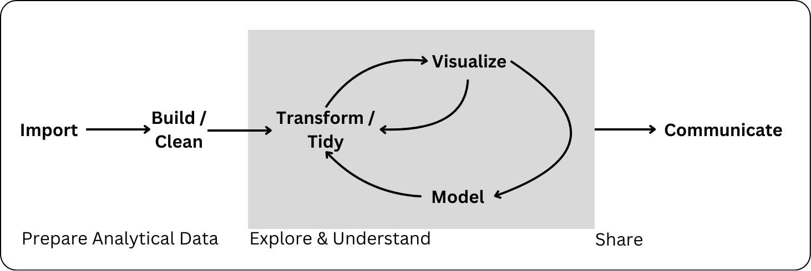

# Data Wrangling

::: callout
## Learning Objectives
+ Identify the rectangular dataset required for a given task.
+ Identify required sequence of steps to get from one rectangular dataset to another.
+ Apply data manipulation verbs (`filter()`, `select()`, `group_by()`, `summarize()`, `mutate()`) to get from one rectangular dataset to another
+ Describe step-by-step data cleaning process in lay terms appropriately and understand the consequences of data cleaning steps.
:::


## Welcome to the tidyverse!

Since R is open source, there are many different options for functions that can accomplish the same task. Over time, full sets of functions and packages have been developed with the purpose of working well together for data analysis and visualization. 

In this class, we will use the `tidyverse` set of packages to visualize and wrangle data. This **decision** impacts the way that we will think about working with data (in a good way - in our opinion!). 

In their own words, the `tidyverse` developers describe it as:

>an opinionated collection of R packages designed for data science. All packages share an underlying design philosophy, grammar, and data structures.[^1]

Most of the functionality you will need for an entire data analysis workflow will have the **cohesive grammar** of the tidyverse. Already, you have learned how to read in data with `readr` and visualize data with `ggplot2`.




[^1]: https://www.tidyverse.org/

## Data Wrangling

We are going to keep working with the `cereal` dataset in the `liver` package. Take a minute to remind yourself what the data looks like!


::: panel-tabset

### Load Data

```{r}
# load liver package
library(liver)

# load cereal data which is included in the package
data(cereal)
```


### First Rows

```{r}
head(cereal)
```

### Column Types

```{r}
str(cereal)
```

:::

Let's start exploring the data. Maybe I want to look at the distribution of fiber for cereals from different manufacturers.


::: panel-tabset

### `ggplot` review

Recreate the plot below trying not to look at the code!


```{r}
#| echo: false

library(tidyverse)

cereal |> 
  ggplot(aes(x = fiber)) +
  geom_histogram() +
  facet_wrap(vars(manuf)) +
  labs(x = "Fiber (g)",
       y = "",
       subtitle = "Number of Cereals",
       title = "Cereal Fiber by Manufacturer")
```


### solution

```{r}
#| eval: false

ggplot(cereal, aes(x = fiber)) +
  geom_histogram() +
  facet_wrap(vars(manuf)) +
  labs(x = "Fiber (g)",
       y = "",
       subtitle = "Number of Cereals",
       title = "Cereal Fiber by Manufacturer")
```
:::


Okay, there is a lot going on here and some manufacturers don't have that many cereals anyway! 

I would rather just look at the two biggest manufacturers, General Mills and Kelloggs and while I am at it, it would be nice to change the labels from "G" and "K" to these recognizable names. But how to do this?

**Most of the the time, the data we have isn't exactly what we need for a specific plot or analysis.** This is where data *wrangling*, *cleaning*, and *manipulation* come in, which is the focus of the next couple of weeks of class.

Before jumping into any code, it is important to think about what the data is that we want for a plot or analysis and the steps that will take us from the current data to that version. 


:::{.callout-check-in .icon}
**In groups**, first **draw** the output that is described and then **describe** in words the **steps** you would take from `cereal` data to get the output for each of the following:

1. Plot just the fiber for Kelloggs and General Mills and make the manufacturer labels more clear.

2. What is the ratio of fiber to sugars in each cereal?

3. Create a new dataset that only has Nabisco cereals and displays the protein, fat, and sodium in each.

4. Create a table that shows, for each manufacturer the average and standard deviation of the grams of sugar in their cereals, along with how many cereals are in the data for each manufacturer. Order the table from most sugar (on average) to least.
:::


## `dplyr` for Data Wrangling

`dplyr` is part of the **tidyverse** that provides us with the *Grammar of Data Manipulation*.

+ This package gives us the tools to **wrangle, manipulate, and tidy** our data with ease.
+ Check out the `dplyr` [cheatsheet](https://github.com/rstudio/cheatsheets/blob/main/data-transformation.pdf).

Each `dplyr` verb describes a common task for working with rectangular data. In all tidyverse functions, **data comes first** -- literally, as it's the first argument to any function. 

In addition, you don't use `df$variable` to access a variable - you refer to the variable by its name alone ("bare" names). This makes the syntax much cleaner and easier to read, which is another principle of the tidy philosophy.

The primary verbs are:

-   `filter()` / `filter_out()`
-   `arrange()`
-   `select()`
-   `mutate()`
-   `summarize()`
-   Use `group_by()` to perform group wise operations
-   Use the pipe operator (`|>` or `%>%`) to chain together data wrangling operations


### `filter()` and `filter_out()`

{fig-alt="Cartoon showing three fuzzy monsters either selecting or crossing out rows of a data table. If the type of animal in the table is “otter” and the site is “bay”, a monster is drawing a purple rectangle around the row. If those conditions are not met, another monster is putting a line through the column indicating it will be excluded. Stylized text reads “dplyr::filter() - keep rows that satisfy your conditions.”"}


Sometimes rather than thinking about *keeping* rows based on some criteria, it makes more sense to think about *dropping* rows based on a criteria. This is when the brand new `filter_out()` is useful!


::: note
#### Useful comparison operations in R {-}

We might not always want to only filter on a variable set equal to a certain category or value, the following operations can help you combine logical operations in `filter()`.

-   `>` greater than
-   `<` less than
-   `==` equal to
-   `%in%` identifies if an element belongs to a vector
-   `is.na()` binary evaluation of missing values
-   `|`, `when_any()` or
-   `,`, `&`, `when_all()` and 
:::

:::{.callout-check-in .icon}
1.  How can you join two logical statements with an "or" in `filter()`?

2.  How can you join two logical statements with an "and" in `filter()`?

3.  How can you join two logical statements with an "or" in `filter_out()`?

:::


::: panel-tabset
### practice

Create a new dataset with only Kellogg's and General Mills cereals. 


### solution

More elegant solution using `%in%`:
```{r}
#| eval: false

filter(cereal,
       manuf %in% c("K", "G"))
```

`|` also gets you there:

```{r}
#| eval: false

filter(cereal,
       manuf == "K" | manuf == "G")
```

Think about it -- why is the first solution above preferable?

:::

### piping operator `|>`

Okay now we at least have gotten down to the two manufacturers we are interested! Let's use this data to create a new plot.

My first idea is that I could save a newdataset called `plot_data` and then make the plot with that dataset:

```{r}
# save new data
plot_data <- filter(cereal,
       manuf %in% c("K", "G"))

# plot with that data
ggplot(plot_data, aes(x = fiber)) +
  geom_histogram() +
  facet_wrap(vars(manuf)) +
  labs(x = "Fiber (g)",
       y = "",
       subtitle = "Number of Cereals",
       title = "Cereal Fiber by Manufacturer")
```

This is fine, but if I am not actually going to use my `plot_data` again, I don't really need to save it.

Okay, instead I could put this new data into the `data` argument in ggplot:

```{r}
ggplot(filter(cereal,
       manuf %in% c("K", "G")), aes(x = fiber)) +
  geom_histogram() +
  facet_wrap(vars(manuf)) +
  labs(x = "Fiber (g)",
       y = "",
       subtitle = "Number of Cereals",
       title = "Cereal Fiber by Manufacturer")
```

That definitely works, but it's super hard to read and see what is going on!

This is where the **piping operator** comes in! The pipeing operator lets us "pipe" the output from one line of code into the next. 

There are two piping operators: the native pipe `|>` and the original" pipe `%>%`. We will use the native pipe `|>`, but you will still see the "original" pipe around as an FYI.

The pipe operator takes whatever is to the left of it, and inputs that as the **first** argument in the function to the right.

For example, instead of `head(cereal)`,

```{r}
cereal |> 
  head()
```

Building onto this, the first argument in `filter()` (and all other `dplyr` verbs) is the data frame, so we can do:

```{r}
cereal |> 
  filter(manuf %in% c("K", "G")) |> 
  head()
```

Again, this is so much better to read rather than
```{r}
#| eval: false

head(filter(cereal, manuf %in% c("K", "G")))
```
especially as our analyses get more complicated and with more steps!


We can put this all together for readable code for our plot! Note that the first argument in `ggplot()` is also the data.

```{r}
cereal |> 
  filter(manuf %in% c("K", "G")) |> 
  ggplot(aes(x = fiber)) +
    geom_histogram() +
    facet_wrap(vars(manuf)) +
    labs(x = "Fiber (g)",
         y = "",
         subtitle = "Number of Cereals",
         title = "Cereal Fiber by Manufacturer")
```


### `arrange()`


These functions implicitly arrange the data before slicing it (selecting rows).

+ `slice_min()` -- select rows with the lowest value(s) of a variable
+ `slice_max()` -- select rows with the highest value(s) of a variable


### `select()`

We **select** which variables we would like to remain in the data.


-   `var3:var5`: `select(df, var3:var5)` will give you a data frame with columns var3, anything between var3 and var 5, and var5

-   `!(<set of variables>)` will give you any columns that aren't in the set of variables in parentheses

    -   `(<set of vars 1>) & (<set of vars 2>)` will give you any variables that are in both set 1 and set 2. `(<set of vars 1>) | (<set of vars 2>)` will give you any variables that are in either set 1 or set 2.
    -   `c()` combines sets of variables.

`dplyr` also defines a lot of variable selection "helpers" that can be used inside `select()` statements. These statements work with bare column names (so you don't have to put quotes around the column names when you use them).

-   `everything()` matches all variables
-   `last_col()` matches the last variable. `last_col(offset = n)` selects the n-th to last variable.
-   `starts_with("xyz")` will match any columns with names that start with xyz. Similarly, `ends_with()` does exactly what you'd expect as well.
-   `contains("xyz")` will match any columns with names containing the literal string "xyz". Note, `contains` does not work with regular expressions (you don't need to know what that means right now).
-   `matches(regex)` takes a regular expression as an argument and returns all columns matching that expression.
-   `num_range(prefix, range)` selects any columns that start with prefix and have numbers matching the provided numerical range.

There are also selectors that deal with character vectors. These can be useful if you have a list of important variables and want to just keep those variables.

-   `all_of(char)` matches all variable names in the character vector `char`. If one of the variables doesn't exist, this will return an error.
-   `any_of(char)` matches the contents of the character vector `char`, but does not throw an error if the variable doesn't exist in the data set.

There's one final selector -

-   `where()` applies a function to each variable and selects those for which the function returns TRUE. This provides a lot of flexibility and opportunity to be creative.


### `mutate()`


### `summarize()`


### `group_by()`

:::{.callout-check-in .icon}
**In groups** match the `dplyr` verbs to your suggested steps:

1. What is the ratio of fiber to sugars in each cereal?

2. Create a new dataset that only has Nabisco cereals and displays the protein, fat, and sodium in each.

3. Create a table that shows, for each manufacturer the average and standard deviation of the grams of sugar in their cereals, along with how many cereals are in the data for each manufacturer. Order the table from most sugar (on average) to least.
:::


<!--# `filter`

# `select`

> include **columns** based on one or more logical statements

3.  What symbol do you use to **remove** a column from the dataset?

# `mutate()`

> create new columns or change existing columns

4.  What are the three arguments of the `if_else()` function?

# `arrange()`

> Organize the rows of the data in order of a particular variable.

5.  By default what order does the `arrange()` function put values in?

6.  What can you add **inside** the `arrange()` function to change the default order?

# `arrange()` friends

7.  What does the `n` argument of `slice_max()` and `slice_min()` do?

# `summarize`

> compute a table of summaries

8.  What are common summary functions you might want to use?

# `group_by`

> put rows into groups based on values in column(s)

9.  What happens when you group by **two** variables?

-->


:::{.callout-required-reading .icon}
To review what we covered this week, refer to **Chapter 3: Data Transformation** in R4DS  [https://r4ds.hadley.nz/data-transform.html](https://r4ds.hadley.nz/data-transform.html)
:::
